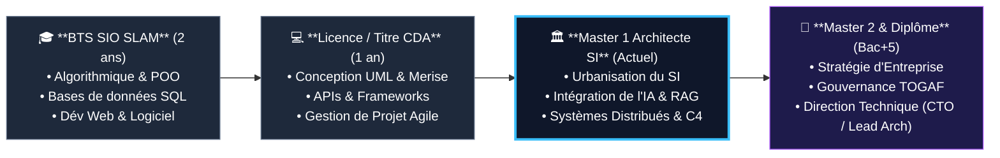

# Profil & Contexte de l'Étudiant — Master 1 Architecture SI

**Fichier de référence :** Contexte apprenant & trajectoire professionnelle  
**Dernière mise à jour :** 14/09/2026  

---

## 📑 Sommaire du Document
- [1. Fiche d'Identité & Situation Actuelle](#1-fiche-didentité--situation-actuelle)
- [2. Parcours Académique & Technique](#2-parcours-académique--technique)
  - [2.1. Les étapes clés du cursus](#21-les-étapes-clés-du-cursus)
  - [2.2. Frise chronologique du parcours](#22-frise-chronologique-du-parcours)
- [3. Évolution de la Posture : Du Développeur à l'Architecte SI](#3-évolution-de-la-posture--du-développeur-à-larchitecte-si)
  - [3.1. Tableau comparatif des compétences par niveau](#31-tableau-comparatif-des-compétences-par-niveau)
- [4. Objectifs Pédagogiques & Professionnels en Master SI](#4-objectifs-pédagogiques--professionnels-en-master-si)
- [5. Directives pour les Futurs Cours & Projets](#5-directives-pour-les-futurs-cours--projets)

---

## 1. Fiche d'Identité & Situation Actuelle

| Information | Détail |
| :--- | :--- |
| **Âge** | 25 ans |
| **Établissement** | **CFA-INSTA** (Paris) |
| **Niveau actuel** | **Master 1 — Architecte des Systèmes d'Information** |
| **Spécialisation** | **Architecture Logicielle & Solutions Applicatives** |
| **Mode d'apprentissage** | Alternance / Entreprise & École |

---

## 2. Parcours Académique & Technique

### 2.1. Les étapes clés du cursus
1. **BTS SIO option SLAM (2 ans) — Bac+2 :**
   * *Intitulé :* Services Informatiques aux Organisations — Solutions Logicielles et Applications Métiers.
   * *Socle acquis :* Algorithmique, programmation orientée objet, bases de données relationnelles (SQL, MCD/MLD), développement web et applicatif, travail en environnement réseau de base.
2. **Titre Professionnel CDA (1 an) — Bac+3 :**
   * *Intitulé :* Concepteur Développeur d'Applications.
   * *Socle acquis :* Conception logicielle avancée (UML, Merise), architectures multi-tiers (MVC, API REST), frameworks modernes (backend et frontend), bases de l'intégration continue (CI/CD) et gestion de projet Agile (Scrum).
3. **Master Architecte des SI (En cours) — Bac+4 / Bac+5 :**
   * *Objectif :* Conception de systèmes distribués à haute disponibilité, urbanisation des SI d'entreprise, intégration de l'intelligence artificielle, gouvernance, sécurité et direction technique.

---

### 2.2. Frise chronologique du parcours

---

## 3. Évolution de la Posture : Du Développeur à l'Architecte SI

Grâce à ce socle technique solide (SLAM + CDA), l'étudiant possède déjà une excellente compréhension du code et des bases de données.  
Le défi du Master 1 est de **prendre de la hauteur** :

### 3.1. Tableau comparatif des compétences par niveau

| Critère | Profil BTS SIO SLAM | Profil CDA (Bac+3) | Profil Architecte SI (Master 1) |
| :--- | :--- | :--- | :--- |
| **Échelle de vision** | La fonction, la méthode, la page web | L'application complète, la base de données | Le Système d'Information global (SI), les flux inter-applications |
| **Objectif premier** | *"Que le code s'exécute sans bug"* | *"Que l'application réponde au besoin utilisateur"* | *"Que le SI soit scalable, sécurisé, urbanisé et rentable"* |
| **Modélisation** | Diagramme de classes simple, MCD | Diagramme de cas d'utilisation, de séquence | Modèle C4 (Niveaux 1 à 4), ArchiMate, POS d'urbanisme |
| **Rapport à l'IA** | Utilisateur de copilote de code | Intégration d'un appel d'API IA basique | Architecture de Hub IA, RAG d'entreprise, MLOps, FinOps |
| **Livrable type** | Code source, scripts SQL | Dossier de conception logicielle (DCL) | Dossier d'Architecture Technique (DAT), ADR (*Decision Records*) |

---

## 4. Objectifs Pédagogiques & Professionnels en Master SI

1. **Maîtriser les architectures modernes :** Microservices, architectures événementielles (*Event-Driven* avec Kafka), Cloud computing hybride.
2. **Connecter l'IA de manière professionnelle :** Savoir brancher des LLMs, concevoir des bases vectorielles (RAG) et orchestrer des agents autonomes sans fragiliser l'existant.
3. **Urbaniser et moderniser le Legacy :** Rénover les anciens systèmes (ERP, ERP historiques, silos de données) sans interruption de service.
4. **Garantir la sécurité & conformité :** Appliquer le Zero Trust, respecter le RGPD et anticiper les contraintes de l'EU AI Act.
5. **Défendre ses choix :** Rédaction de Dossiers d'Architecture Technique (DAT) rigoureux et soutenance face aux comités de direction (*CAB / Architecture Board*).

---

## 5. Directives pour les Futurs Cours & Projets

Dans tous les travaux, synthèses et études de cas produits dans cet espace de travail :
* **Toujours valoriser le socle technique acquis :** Les explications peuvent s'appuyer sur la culture du code (POO, MVC, SQL) issue du BTS SLAM et du CDA.
* **Mettre l'accent sur la vision d'architecte :** Privilégier les schémas d'intégration globale, le choix des protocoles, la résilience aux pannes, la sécurité et la maîtrise des coûts (FinOps).
* **Respecter les conventions documentaires :**
  1. Sommaire interactif cliquable en tête de chaque fichier.
  2. Diagrammes Mermaid visuels avec le thème sombre néon (`classDef`, bordures lumineuses, texte blanc).
  3. Fichiers `README.md` à jour dans chaque dossier.
