# Guide Complet d'Épreuve Orale & Script de Soutenance

## Format Démo Live Parlée (8 Minutes Chrono + 5 Minutes Questions)

* **Cursus :** Master 1 Architecte des Systèmes d'Information (Logiciel & Réseau) — CFA INSTA
* **Format officiel imposé (Section 14) :** **8 minutes au total** où la présentation et la démonstration se déroulent **en direct à l'écran**, suivies de **5 minutes de questions techniques**.
* **Support unique de soutenance :** La console Web Streamlit ([http://localhost:8501](http://localhost:8501)) ouverte dès la première seconde.
* **Projet :** Assistant IA d'Exploitation Connecté au SI TECHCORP (FastMCP, FastAPI, PostgreSQL 16, Ollama Qwen 4B, Streamlit).

---

## 📑 Sommaire Interactif

* [1. Stratégie de Démonstration Continue (8 min)](#1-stratégie-de-démonstration-continue-8-min)
  * [1.1. Le principe du « Je parle et je montre en direct »](#11-le-principe-du-je-parle-et-je-montre-en-direct)
  * [1.2. Chronogramme officiel conforme à la section 14](#12-chronogramme-officiel-conforme-à-la-section-14)
* [2. Script Synchronisé Parole & Clics (Minute par Minute)](#2-script-synchronisé-parole--clics-minute-par-minute)
  * [00:00 - 01:00 : Contexte TECHCORP & Schéma d'Architecture](#0000---0100--contexte-techcorp--schéma-darchitecture)
  * [01:00 - 02:30 : Données Brutes & Audit ETL (Onglet 2)](#0100---0230--données-brutes--audit-etl-onglet-2)
  * [02:30 - 04:00 : Scénario F1 — Tickets Critiques via FastAPI](#0230---0400--scénario-f1--tickets-critiques-via-fastapi)
  * [04:00 - 05:30 : Scénario F2 — Fiche Serveur SRV-DB-01 via PostgreSQL direct](#0400---0530--scénario-f2--fiche-serveur-srv-db-01-via-postgresql-direct)
  * [05:30 - 07:00 : Scénario F3 — Le Climax : Diagnostic Contradictoire Inventaire vs Socket TCP](#0530---0700--scénario-f3--le-climax--diagnostic-contradictoire-inventaire-vs-socket-tcp)
  * [07:00 - 08:00 : Sécurité, Observabilité JSONL (Onglet 3) & Conclusion](#0700---0800--sécurité-observabilité-jsonl-onglet-3--conclusion)
* [3. FAQ du Jury & Valorisation des Bonus (5 Minutes de Questions)](#3-faq-du-jury--valorisation-des-bonus-5-minutes-de-questions)
* [4. Checklist Commando (30 Minutes Avant d'Entrer en Salle)](#4-checklist-commando-30-minutes-avant-dentrer-en-salle)

---

## 1. Stratégie de Démonstration Continue (8 min)

### 1.1. Le principe du « Je parle et je montre en direct »

Vous n'avez pas de diapositives séparées : **votre écran Streamlit est votre tableau de bord du début à la fin**.  
Pendant votre intervention, vous naviguez entre les 3 onglets de l'application :
1. **Onglet 1 : `💬 Assistant IA & Scénarios`** : Démonstration des scénarios F1, F2, F3 et tests de sécurité.
2. **Onglet 2 : `📊 Qualité Données (ETL)`** : Preuve absolue de l'audit d'ingestion (rejet IP 999, fusions).
3. **Onglet 3 : `📜 Journaux d'Audit MCP`** : Observabilité temps réel des appels (UUID, statut, durée en millisecondes).

### 1.2. Chronogramme officiel conforme à la section 14

```mermaid
gantt
    title Chronogramme Démo Parlée Synchronisée (8 Minutes)
    dateFormat  s
    axisFormat %M:%S

    section Démo Continue (8 min)
    Contexte & Architecture Réseau       :m1, 0, 60s
    Données Brutes & Audit ETL (Onglet 2):m2, after m1, 90s
    Scénario F1 (Tickets FastAPI)        :m3, after m2, 90s
    Scénario F2 (PostgreSQL Direct)      :m4, after m3, 90s
    Scénario F3 (Contradiction Réseau)   :m5, after m4, 90s
    Observabilité, Sécurité & Conclusion :m6, after m5, 60s

    section Questions Jury (5 min)
    Échange & Questions Techniques       :q1, after m6, 300s
```

---

## 2. Script Synchronisé Parole & Clics (Minute par Minute)

---

### 00:00 - 01:00 : Contexte TECHCORP & Schéma d'Architecture

**Ce que vous faites à l'écran :**
* Vous êtes sur l'interface Streamlit ([http://localhost:8501](http://localhost:8501)) sur l'**Onglet 1**.
* Vous montrez brièvement la barre latérale avec les composants connectés et le plan d'adressage IP (`192.168.56.0/24`).

**Ce que vous dites :**
> *"Bonjour Mesdames et Messieurs les membres du jury.  
> Nous vous présentons aujourd'hui notre solution d'**Assistant IA d'Exploitation Connecté au Système d'Information TECHCORP**.  
> 
> Dans les infrastructures d'exploitation, le principal défi lors d'une astreinte est le **cloisonnement des données** : l'exploitant doit jongler entre les tickets d'incidents, la base CMDB, les logs et les tests réseau.  
> 
> Pour résoudre ce problème sans aucun risque d'hallucination, nous avons conçu une architecture souveraine articulée autour du standard **MCP (Model Context Protocol)** :  
> 1. Un runtime LLM local **Ollama Qwen 4B** qui n'invente rien et raisonne uniquement sur des faits.  
> 2. Un serveur **FastMCP** exposant des outils typés d'investigation et d'action.  
> 3. Une double voie d'accès : **FastAPI** pour l'encapsulation métier des tickets et **PostgreSQL 16** pour la consultation haute performance d'inventaire.  
> 4. Une sonde active de **socket TCP en direct** pour confronter l'inventaire à la réalité physique du réseau."*

---

### 01:00 - 02:30 : Données Brutes & Audit ETL (Onglet 2)

**Ce que vous faites à l'écran :**
* Vous basculez sur le **2ème onglet : `📊 Qualité Données (ETL)`**.
* Vous montrez le tableau de bord des métriques d'ingestion avec les cartes KPI (lignes acceptées, rejetées, corrigées).
* Vous pointez la ligne d'audit montrant le **rejet de `192.168.56.999`**.

**Ce que vous dites :**
> *"Avant d'interroger l'IA, nous avons assaini les données d'exploitation. Conformément aux consignes, **aucun fichier brut n'a été retouché à la main**.  
> 
> Notre script ETL automatisé `clean_and_load.py` a traité l'ensemble des sources brutes et alimenté la table `ingestion_audit` que vous voyez ici à l'écran :  
> • Sur l'inventaire serveur : les doublons `srv-db-01` et `SRV-DB-01 ` ont été dédupliqués et normalisés en majuscules.  
> • L'adresse IP invalide `192.168.56.999` a été immédiatement rejetée par validation regex IPv4 stricte, tout comme le serveur `SRV-API-02` sans adresse IP.  
> • Sur les tickets JSON : les dates hétérogènes ont été unifiées et le ticket incomplet sans machine (#112) a été écarté.  
> 
> La base de données PostgreSQL est saine, normalisée et auditable."*

---

### 02:30 - 04:00 : Scénario F1 — Tickets Critiques via FastAPI

**Ce que vous faites à l'écran :**
* Vous revenez sur l'**Onglet 1 : `💬 Assistant IA & Scénarios`**.
* Vous cliquez sur le bouton bleu **`Scénario F1 : Tickets Critiques`** dans la grille centrale.
* Le résultat s'affiche en quelques secondes. Vous déroulez l'expander *"🛠️ Trace d'exécution MCP & Données Brutes Réelles"*.

**Ce que vous dites :**
> *(Clic sur Scénario F1)*  
> *"L'exploitant débute son astreinte et demande : 'Quels tickets critiques sont ouverts ?'  
> 
> Regardez l'exécution : le modèle local Qwen 4B a analysé la demande et a déclenché l'outil MCP `list_open_tickets(priority="CRITICAL")`.  
> Cet outil n'interroge pas la base directement : il effectue un appel HTTP REST vers l'endpoint `/tickets/open` de notre API **FastAPI**.  
> 
> Dans l'expander de trace technique, vous visualisez le retour JSON brut de l'API avec une latence de quelques millisecondes. L'assistant restitue la synthèse : le ticket critique **#113** concernant des erreurs récurrentes de connexion sur le serveur `SRV-DB-01`.  
> L'exploitant sait immédiatement sur quel serveur porter son attention."*

---

### 04:00 - 05:30 : Scénario F2 — Fiche Serveur SRV-DB-01 via PostgreSQL direct

**Ce que vous faites à l'écran :**
* Vous cliquez sur le bouton vert **`Scénario F2 : Fiche SRV-DB-01`**.
* Le résultat s'affiche. Vous montrez la trace technique.

**Ce que vous dites :**
> *(Clic sur Scénario F2)*  
> *"L'exploitant souhaite obtenir la fiche technique de cette machine : 'Donne-moi les informations de SRV-DB-01'.  
> 
> Cette fois-ci, l'assistant sélectionne l'outil `get_server_info(hostname="SRV-DB-01")`.  
> Contrairement aux tickets, cet outil effectue une requête SQL directe et paramétrée sur la table `servers` de notre base **PostgreSQL**.  
> 
> En moins de 2 millisecondes, nous récupérons la fiche : machine Ubuntu 24.04, adresse IP `192.168.56.20`, rôle Database, et statut déclaré dans l'inventaire : **UP**."*

---

### 05:30 - 07:00 : Scénario F3 — Le Climax : Diagnostic Contradictoire Inventaire vs Socket TCP

**Ce que vous faites à l'écran :**
* Vous cliquez sur le bouton orange **`Scénario F3 : SRV-DB-01 fonctionne-t-il ?`**.
* La réponse s'affiche avec le bandeau d'alerte. Vous pointez du curseur la contradiction mise en évidence.

**Ce que vous dites :**
> *(Clic sur Scénario F3 — Voix claire et assurée)*  
> *"Voici maintenant le cœur de notre valeur ajoutée d'ingénierie : le **scénario contradictoire obligatoire**.  
> L'exploitant demande : 'SRV-DB-01 fonctionne-t-il réellement en ce moment ?'  
> 
> L'assistant orchestre ici deux outils :  
> 1. Il consulte l'inventaire en base : la machine y est déclarée **UP**.  
> 2. Mais au lieu de faire aveuglément confiance à la CMDB statique, il déclenche l'outil `check_server_availability("SRV-DB-01")`.  
> Cet outil ouvre en direct une **socket TCP réelle sur le port 5432** de la machine cible.  
> 
> **Résultat de la sonde réseau :** Le port refuse la connexion (`SERVICE_DOWN`) !  
> Regardez la réponse formulée : l'IA n'invente rien. Elle signale formellement une **contradiction critique** :  
> • *Faits :* Inventaire déclaré UP.  
> • *Vérification technique :* Service PostgreSQL injoignable sur le port 5432.  
> • *Recommandation :* Ne pas éteindre la VM, mais vérifier le démon PostgreSQL via `systemctl status postgresql`."*

---

### 07:00 - 08:00 : Sécurité, Observabilité JSONL (Onglet 3) & Conclusion

**Ce que vous faites à l'écran :**
* Vous cliquez sur le bouton **`Scénario Sécurité : Injection de Prompt`** (rejet immédiat).
* Vous basculez 5 secondes sur le **3ème onglet : `📜 Journaux d'Audit MCP`**.
* Vous faites défiler les logs d'audit structurés en montrant les UUID et les durées en millisecondes.
* Vous revenez face au jury.

**Ce que vous dites :**
> *(Clic sur Sécurité puis bascule sur l'Onglet 3)*  
> *"Sur le plan de la sécurité : face à une tentative d'injection ordonnant de lire le fichier `.env` ou d'exécuter du shell, l'assistant refuse catégoriquement. Aucun outil shell arbitraire n'existe dans le serveur MCP, et notre matrice de rôles **RBAC** encadre chaque prérogative.  
> 
> Enfin, sur ce 3ème onglet, chaque requête est auditée avec un identifiant unique UUID v4, la traçabilité de l'outil, le statut et le temps d'exécution en millisecondes.  
> 
> En conclusion, notre projet TECHCORP SI concilie la puissance de l'IA locale souveraine avec la rigueur d'un système déterministe, sécurisé et auditable.  
> 
> Nous vous remercions pour votre écoute et nous sommes prêts pour vos questions."*

---

## 3. FAQ du Jury & Valorisation des Bonus (5 Minutes de Questions)

### Q1 : Pourquoi avoir choisi FastMCP plutôt qu'une suite de fonctions Python classiques ?
* **Réponse :**  
  > *"FastMCP implémente le standard ouvert Model Context Protocol. Les capacités sont exposées via des contrats JSON-Schema auto-descriptifs. Si demain nous remplaçons notre modèle local par un autre LLM ou si nous déportons nos outils sur un cluster distant en transport SSE, l'architecture reste identique sans réécrire l'interface."*

### Q2 : Comment garantissez-vous que le LLM n'invente jamais de réponse ?
* **Réponse :**  
  > *"Par un ancrage strict (*Strict Grounding*) : le prompt système interdit d'extrapoler l'état d'un service. Les données brutes issues des Tools MCP sont injectées comme faits stricts et vérifiables. Si un Tool échoue ou si le service est coupé, l'IA est forcée de restituer fidèlement l'état réel mesuré."*

### Q3 : Pourquoi avoir conservé à la fois du SQL direct et une API FastAPI ?
* **Réponse :**  
  > *"C'est un choix d'urbanisation délibéré :  
  > Pour les **tickets**, l'API FastAPI encapsule la logique métier, la validation Pydantic et la journalisation des écritures.  
  > Pour l'**inventaire**, le requêtage SQL direct paramétré évite la surconsommation réseau et répond avec une latence inférieure à 2 millisecondes."*

### Q4 : Quels bonus de la section 15.2 avez-vous implémentés ?
* **Réponse :**  
  > *"Nous avons validé les 6 bonus du barème :  
  > 1. Une suite complète de tests automatisés pytest couvrant les 6 requêtes SQL de la section 4.2, l'ETL, FastAPI et le MCP.  
  > 2. Une dockerisation propre via `compose.yml` (PostgreSQL 16, Nginx, Ollama).  
  > 3. Un dashboard Streamlit à 3 onglets avec métriques d'ingestion et observabilité des logs.  
  > 4. Une matrice RBAC basée sur la table `roles` limitant les prérogatives des outils.  
  > 5. L'orchestration multi-outils avec synthèse croisée déterministe.  
  > 6. La documentation complète du transport réseau sécurisé."*

### Q5 : Que se passe-t-il si la base PostgreSQL est indisponible ?
* **Réponse :**  
  > *"Notre module de connexion implémente un mécanisme de fallback transparent : si la connexion à PostgreSQL échoue, le système bascule automatiquement sur un clone local SQLite `techcorp.db` initialisé avec le même schéma SQL. L'exploitant conserve un service continu même en mode dégradé."*

---

## 4. Checklist Commando (30 Minutes Avant d'Entrer en Salle)

1. [ ] **PC branché sur secteur** (performances CPU et RAM maximales).
2. [ ] **Services lancés et testés en arrière-plan :**
   - FastAPI : [http://localhost:8000/docs](http://localhost:8000/docs) (Swagger actif)
   - Streamlit : [http://localhost:8501](http://localhost:8501) (les 3 onglets ouverts)
   - Ollama : vérifié via `curl http://localhost:11434`
3. [ ] **Pré-chauffe de la mémoire vive :** Cliquer une fois sur le bouton du Scénario F1 et F3 pour charger le modèle `qwen3:4b` dans le cache.
4. [ ] **Chronomètre physique ou smartphone posé à côté du clavier :** Lancement à la première seconde de la prise de parole.
5. [ ] **Fluidité :** Garder un débit calme et poser son regard sur le jury pendant que l'IA calcule.
