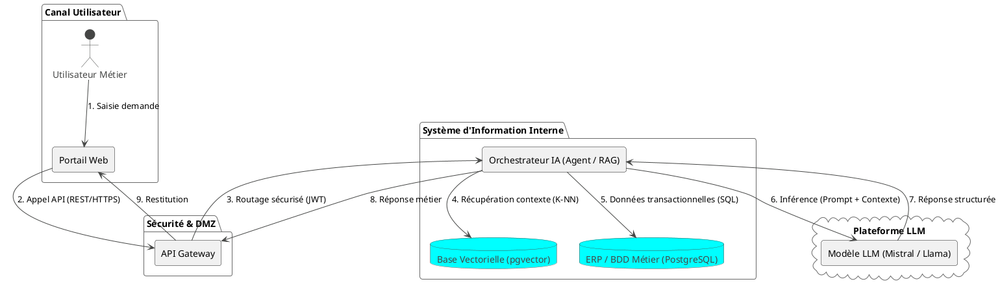
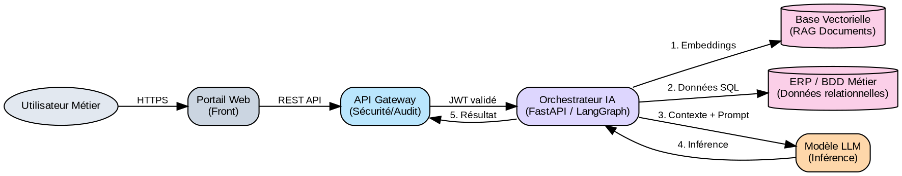

# Guide Comparatif des Formats de Diagrammes d'Architecture SI (Diagrams-as-Code)

**Contexte d'exemple commun à tous les formats :**

> **Scénario d'Architecture SI :** *Connexion d'un service d'IA (RAG & Agent) au Système d'Information de l'Entreprise.*
> Un **Utilisateur** formule une demande via le **Portail Web**. La requête passe par une **API Gateway (Sécurité & Rate Limiting)**, arrive sur le **Service Orchestrateur IA**. Ce dernier interroge la **Base Vectorielle (pgvector / Qdrant)** pour le contexte documentaire et l'**ERP / Base SQL Métier** pour les données de gestion, puis sollicite le **Modèle LLM** avant de restituer la réponse.

---

## 📑 Sommaire du Document
- [Contexte d'exemple commun à tous les formats](#guide-comparatif-des-formats-de-diagrammes-darchitecture-si-diagrams-as-code)
- [1. Mermaid.js (Markdown natif)](#1-mermaidjs)
- [2. PlantUML (Standard d'entreprise)](#2-plantuml)
- [3. C4 Model via C4-PlantUML (Zoom Niveaux 1 à 4)](#3-c4-model-via-c4-plantuml)
- [4. D2 - Declarative Diagramming (Moderne & Nesting)](#4-d2-declarative-diagramming)
- [5. Graphviz - DOT Language (Graphes mathématiques)](#5-graphviz-dot-language)
- [6. Diagrams Python (Cloud Infrastructure-as-Code)](#6-diagrams-python)
- [7. DBML - Database Markup Language (Schémas BDD)](#7-dbml-database-markup-language)
- [8. BPMN 2.0 XML (Processus Métier & Workflows)](#8-bpmn-20-business-process-model-and-notation---représentation-xml--séquence)
- [9. ArchiMate 3.0 XML (Architecture d'Entreprise TOGAF)](#9-archimate-open-group-exchange-format)
- [Tableau Récapitulatif de Synthèse](#tableau-récapitulatif-de-synthèse)

---

## 1. Mermaid.js

* **Usage :** Rendu natif en Markdown (GitHub, GitLab, Obsidian, Notion, VS Code).
* **Fichier :** `.mmd` ou bloc ` ```mermaid `

```mermaid
flowchart TD
    subgraph Client ["Canal Utilisateur"]
        User(["👤 Utilisateur Métier"])
        Web["💻 Portail Web d'Entreprise"]
        User -->|HTTPS| Web
    end

    subgraph Securite ["Couche Frontale & Sécurité"]
        Gateway["🛡️ API Gateway / Reverse Proxy\n(OAuth2, JWT, Rate-Limiting)"]
        Web -->|Requête API| Gateway
    end

    subgraph Traitement ["Cœur Applicatif & IA"]
        Orchestrator["⚙️ Orchestrateur IA / Agent\n(LangChain / LangGraph)"]
        Gateway -->|Payload validé| Orchestrator
    end

    subgraph Donnees ["Couche Données & Référentiels SI"]
        VectorDB[("📚 Base Vectorielle\n(Documents & RAG)")]
        ERPDB[("🏢 BDD Métier & ERP\n(PostgreSQL / SAP)")]
    end

    subgraph LLMCloud ["Fournisseur de Modèle"]
        LLM["🧠 Moteur LLM\n(Cloud Souverain / On-Premise)"]
    end

    Orchestrator -->|1. Recherche similarité| VectorDB
    Orchestrator -->|2. Requête SQL métier| ERPDB
    Orchestrator -->|3. Prompt enrichi| LLM
    LLM -.->|4. Réponse générée| Orchestrator
    Orchestrator -.->|5. Réponse finale| Gateway

    classDef user fill:#334155,stroke:#94a3b8,color:#fff;
    classDef security fill:#1e293b,stroke:#38bdf8,color:#fff;
    classDef app fill:#0f172a,stroke:#818cf8,color:#fff;
    classDef data fill:#1e1b4b,stroke:#a855f7,color:#fff;
    classDef ia fill:#3b0764,stroke:#ec4899,color:#fff;

    class User,Web user;
    class Gateway security;
    class Orchestrator app;
    class VectorDB,ERPDB data;
    class LLM ia;
```



---

## 2. PlantUML

* **Usage :** Standard historique des DSI pour les dossiers d'architecture technique (DAT) et les diagrammes UML.
* **Fichier :** `.puml`



---

## 3. C4 Model (via C4-PlantUML)

* **Usage :** La référence des architectes logiciels. Découpage standardisé en 4 niveaux de zoom (ici niveau 2 : **Container Diagram**).
* **Fichier :** `.puml`

```plantuml
@startuml C4_Container_IA
!include https://raw.githubusercontent.com/plantuml-stdlib/C4-PlantUML/master/C4_Container.puml

Person(user, "Utilisateur Métier", "Employé consultant le système d'aide à la décision.")

System_Boundary(c1, "Système d'Information d'Entreprise") {
    Container(web_app, "Portail Web", "React, TypeScript", "Interface utilisateur pour formuler les requêtes et consulter les analyses.")
    Container(api_gateway, "API Gateway", "Kong / Traefik", "Authentifie, contrôle les quotas et sécurise les échanges.")
    Container(ia_service, "Service IA & RAG", "Python, FastAPI, LangGraph", "Orchestre les agents, gère la mémoire et assemble le prompt enrichi.")
    ContainerDb(vector_db, "Base Vectorielle", "Qdrant / pgvector", "Stocke les embeddings des documents de l'entreprise.")
    ContainerDb(legacy_db, "Base Métier ERP", "PostgreSQL", "Stocke les données financières et opérationnelles.")
}

System_Ext(llm_service, "Service LLM", "Mistral AI / OpenAI", "Exécute l'inférence générative via API sécurisée.")

Rel(user, web_app, "Interagit avec", "HTTPS")
Rel(web_app, api_gateway, "Envoie les requêtes à", "JSON/HTTPS")
Rel(api_gateway, ia_service, "Transmet l'appel après validation JWT", "gRPC / REST")
Rel(ia_service, vector_db, "Effectue la recherche sémantique", "Vector Search (Cosine)")
Rel(ia_service, legacy_db, "Lit les fiches clients et commandes", "SQL / TCP")
Rel(ia_service, llm_service, "Envoie le prompt enrichi et reçoit l'analyse", "HTTPS/TLS")
@enduml
```

---

## 4. D2 (Declarative Diagramming)

* **Usage :** Outil moderne, rendu vectoriel ultra-soigné, imbrication (nesting) native très lisible.
* **Fichier :** `.d2`

```d2
direction: right

utilisateur: 👤 Utilisateur Métier

si: Système d'Information {
  style.fill: "#f8fafc"
  
  web: Portail Web {
    shape: rectangle
  }
  
  securite: DMZ / Passerelle {
    gateway: API Gateway {
      tooltip: Filtre OAuth2 & Rate-Limiting
    }
  }

  ia_core: Cœur IA {
    orchestrateur: Orchestrateur Agent & RAG
  }

  persistance: Couche Données {
    vectordb: Base Vectorielle (pgvector) {
      shape: cylinder
    }
    erpdb: BDD Métier / ERP {
      shape: cylinder
    }
  }
}

fournisseur_ia: Cloud IA Souverain {
  llm: Moteur LLM
}

utilisateur -> si.web: HTTPS
si.web -> si.securite.gateway: REST API
si.securite.gateway -> si.ia_core.orchestrateur: Payload sécurisé
si.ia_core.orchestrateur -> si.persistance.vectordb: Embeddings & Documents
si.ia_core.orchestrateur -> si.persistance.erpdb: Requêtes SQL
si.ia_core.orchestrateur -> fournisseur_ia.llm: Prompt enrichi
fournisseur_ia.llm -> si.ia_core.orchestrateur: Réponse synthétisée
```

---

## 5. Graphviz (DOT Language)

* **Usage :** Calcul automatique de disposition de graphes mathématiques, arbres de dépendances et pipelines de compilation.
* **Fichier :** `.dot` ou `.gv`



---

## 6. Diagrams (Python)

* **Usage :** Infrastructure-as-Code et architectures Cloud (AWS, GCP, Azure, K8s) générées directement par un script Python.
* **Fichier :** `architecture.py`

```python
# Installation: pip install diagrams
from diagrams import Diagram, Cluster, Edge
from diagrams.onprem.client import Users, Client
from diagrams.onprem.network import Kong
from diagrams.onprem.compute import Server
from diagrams.onprem.database import PostgreSQL
from diagrams.saas.chat import Telegram  # Représente le service externe LLM

with Diagram("Connexion IA au SI d'Entreprise", show=False, direction="LR"):
    user = Users("Utilisateur Métier")
    web = Client("Portail Web")

    with Cluster("Système d'Information de l'Entreprise"):
        gateway = Kong("API Gateway")
    
        with Cluster("Service IA"):
            orchestrator = Server("Orchestrateur RAG & Agents")

        with Cluster("Stockage & Données"):
            vectordb = PostgreSQL("Base Vectorielle (pgvector)")
            erpdb = PostgreSQL("Base Métier ERP")

    llm = Server("Fournisseur Modèle LLM")

    # Flux
    user >> web >> gateway >> orchestrator
    orchestrator >> Edge(label="Recherche contextuelle") >> vectordb
    orchestrator >> Edge(label="Lecture SQL") >> erpdb
    orchestrator >> Edge(label="Appel inférence") >> llm
```

---

## 7. DBML (Database Markup Language)

* **Usage :** Modélisation de la couche de données (MCD / MLD) interconnectant les tables métiers et le système de cache/logs de l'IA.
* **Fichier :** `schema.dbml`

```dbml
// Modélisation des données relationnelles et vectorielles
Table utilisateurs {
  id integer [primary key, increment]
  nom varchar(100) [not null]
  email varchar(255) [unique, not null]
  role varchar(50)
  created_at timestamp [default: `now()`]
}

Table documents_metier {
  id integer [primary key, increment]
  titre varchar(255) [not null]
  chemin_ged varchar(500)
  departement varchar(100)
}

Table embeddings_rag {
  id uuid [primary key]
  document_id integer [ref: > documents_metier.id]
  chunk_content text [note: 'Extrait de texte découpé']
  vector_384 float8[] [note: 'Vecteur généré pour la similarité']
  created_at timestamp
}

Table sessions_ia {
  id uuid [primary key]
  user_id integer [ref: > utilisateurs.id]
  prompt text [not null]
  reponse_ia text [not null]
  tokens_consommes int
  score_confiance float
  timestamp timestamp [default: `now()`]
}
```

---

## 8. BPMN 2.0 (Business Process Model and Notation - Représentation XML & Séquence)

* **Usage :** Modélisation des processus métier et des workflows exécutables (moteurs de règles Camunda / Flowable).
* **Fichier :** `.bpmn` (Standard XML)

```xml
<?xml version="1.0" encoding="UTF-8"?>
<bpmn:definitions xmlns:bpmn="http://www.omg.org/spec/BPMN/20100524/MODEL"
                  id="Definitions_Connecter_IA"
                  targetNamespace="http://cfa-insta.fr/bpmn">
  <bpmn:process id="Process_Requete_IA" name="Traitement Requête Assistée par IA" isExecutable="true">
  
    <!-- 1. Événement de début -->
    <bpmn:startEvent id="Start_Demande" name="Demande utilisateur reçue"/>
  
    <!-- 2. Tâche de validation et sécurité -->
    <bpmn:sequenceFlow id="f1" sourceRef="Start_Demande" targetRef="Task_Authentification"/>
    <bpmn:serviceTask id="Task_Authentification" name="Valider Token & Quota (API Gateway)"/>
  
    <!-- 3. Tâche d'enrichissement RAG -->
    <bpmn:sequenceFlow id="f2" sourceRef="Task_Authentification" targetRef="Task_RAG"/>
    <bpmn:serviceTask id="Task_RAG" name="Rechercher contexte documentaire & données ERP"/>
  
    <!-- 4. Tâche d'inférence LLM -->
    <bpmn:sequenceFlow id="f3" sourceRef="Task_RAG" targetRef="Task_Inference"/>
    <bpmn:serviceTask id="Task_Inference" name="Générer réponse via Modèle LLM"/>

    <!-- 5. Tâche de contrôle de sécurité (Garde-fous) -->
    <bpmn:sequenceFlow id="f4" sourceRef="Task_Inference" targetRef="Task_Guardrails"/>
    <bpmn:serviceTask id="Task_Guardrails" name="Filtrer hallucinations & fuites de données (DLP)"/>
  
    <!-- 6. Événement de fin -->
    <bpmn:sequenceFlow id="f5" sourceRef="Task_Guardrails" targetRef="End_Reponse"/>
    <bpmn:endEvent id="End_Reponse" name="Réponse retournée à l'utilisateur"/>

  </bpmn:process>
</bpmn:definitions>
```

---

## 9. ArchiMate (Open Group Exchange Format)

* **Usage :** Le standard mondial d'Architecture d'Entreprise (TOGAF), structuré en 3 couches (Business Layer, Application Layer, Technology Layer).
* **Fichier :** `.archimate` (XML Open Group Standard)

```xml
<?xml version="1.0" encoding="UTF-8"?>
<model xmlns="http://www.opengroup.org/xsd/archimate/3.0/"
       name="Modele_Integration_IA_SI">
  <elements>
    <!-- Couche Métier (Business Layer) -->
    <element identifier="id-actor-1" xsi:type="BusinessActor" name="Gestionnaire Métier"/>
    <element identifier="id-bprocess-1" xsi:type="BusinessProcess" name="Analyse et Décision Assistée"/>

    <!-- Couche Applicative (Application Layer) -->
    <element identifier="id-app-web" xsi:type="ApplicationComponent" name="Portail Métier Web"/>
    <element identifier="id-app-gateway" xsi:type="ApplicationComponent" name="Passerelle API & Sécurité"/>
    <element identifier="id-app-orchestrator" xsi:type="ApplicationComponent" name="Moteur d'Orchestration IA"/>
    <element identifier="id-data-erp" xsi:type="DataObject" name="Référentiel Données Métier"/>

    <!-- Couche Technologique (Technology Layer) -->
    <element identifier="id-node-vector" xsi:type="Node" name="Cluster pgvector / Base Vectorielle"/>
    <element identifier="id-service-llm" xsi:type="TechnologyService" name="API Service LLM Dédié"/>
  </elements>
</model>
```

---

## Tableau Récapitulatif de Synthèse

| Format                   | Type de syntaxe             | Outils recommandés                 | Idéal pour...                                             |
| :----------------------- | :-------------------------- | :---------------------------------- | :--------------------------------------------------------- |
| **Mermaid.js**     | Texte déclaratif simple    | VS Code, Obsidian, GitHub           | Documentation technique Markdown au quotidien              |
| **PlantUML**       | Langage de balisage UML     | Extension VS Code, Serveur PlantUML | Diagrammes de séquence, classes et états en entreprise   |
| **C4-PlantUML**    | Extension C4 de PlantUML    | VS Code, Structurizr                | Livrables d'architecte solution (DAT, zoom niveaux 1 à 4) |
| **D2Lang**         | Langage déclaratif moderne | CLI`d2`, plugin VS Code           | Schémas d'architecture modernes, propres et esthétiques  |
| **Graphviz (DOT)** | Langage de graphes          | Graphviz CLI, Doxygen               | Arbres de dépendances et pipelines de calcul              |
| **Diagrams**       | Script Python               | Python 3 + Graphviz                 | Documentation d'infrastructures Cloud (AWS/GCP/Azure)      |
| **DBML**           | Langage orienté BDD        | dbdocs.io, dbdiagram.io             | Modélisation des schémas relationnels et vectoriels      |
| **BPMN 2.0**       | XML normé ISO              | Camunda Modeler, Signavio           | Processus métier et workflows exécutables                |
| **ArchiMate**      | XML normé Open Group       | Archi (Open Source), Mega           | Architecture d'Entreprise globale et gouvernance TOGAF     |
