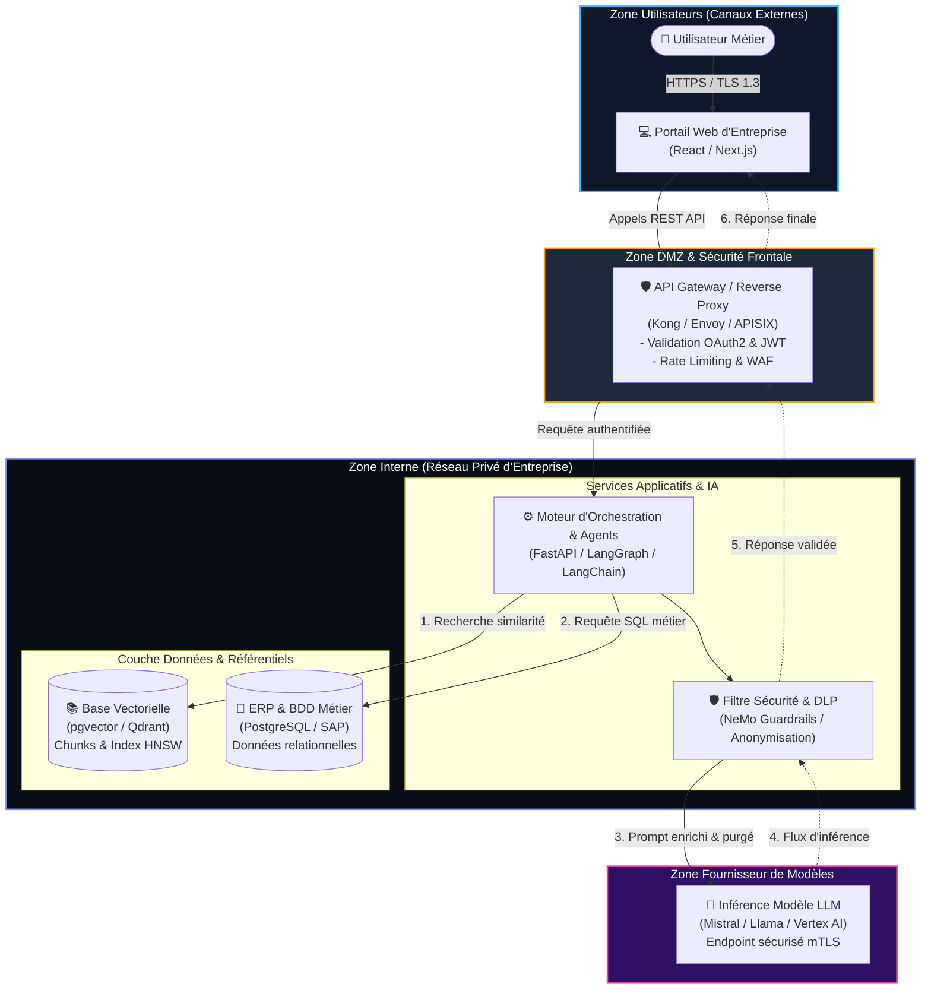
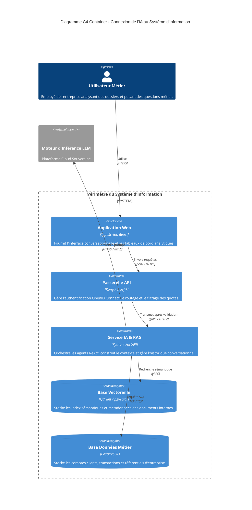
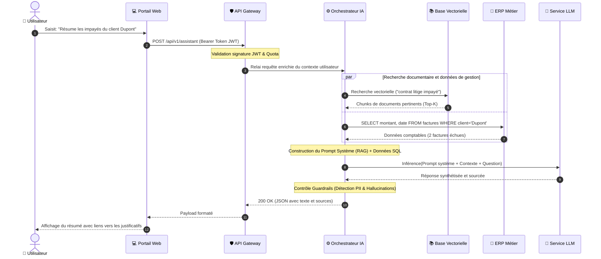
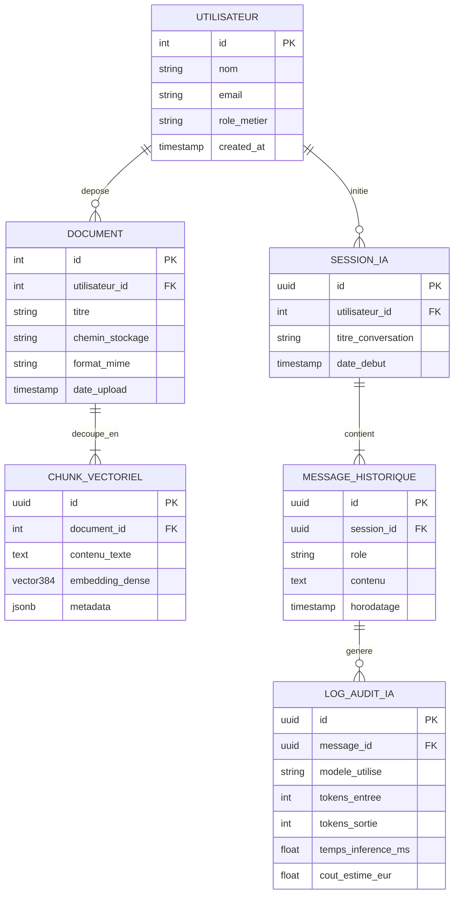
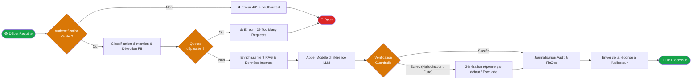
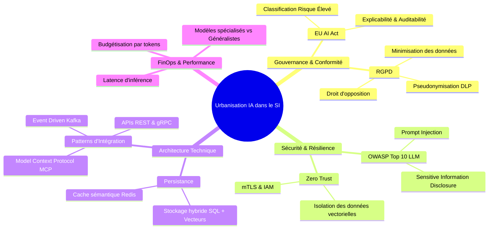

# Galerie Visuelle d'Architecture SI (100% Rendu Graphique en Mermaid)

Ce document décline **l'intégralité des facettes d'un projet d'architecture SI / IA** sous forme de diagrammes **directement interprétés et affichés graphiquement** par votre lecteur Markdown sans aucun compilateur externe.

---

## 📑 Sommaire du Document
- [Vue 1. Architecture Système & Découpage en Zones (Équivalent D2 / Graphviz)](#vue-1-architecture-système--découpage-en-zones-équivalent-d2--graphviz)
- [Vue 2. Architecture Logicielle Formelle C4 Model - Container (Équivalent C4-PlantUML)](#vue-2-architecture-logicielle-formelle-c4-model-container-diagram)
- [Vue 3. Diagramme de Séquence des Échanges (Équivalent PlantUML Sequence)](#vue-3-diagramme-de-séquence-des-échanges-équivalent-plantuml-sequence)
- [Vue 4. Schéma de Données Entité-Relation (Équivalent DBML)](#vue-4-schéma-de-données-entité-relation-équivalent-dbml)
- [Vue 5. Processus Métier & Workflow de Contrôle (Équivalent BPMN)](#vue-5-processus-métier--workflow-de-contrôle-équivalent-bpmn)
- [Vue 6. Cartographie Stratégique & Risques (Mindmap de Gouvernance)](#vue-6-cartographie-stratégique--risques-mindmap-de-gouvernance)

---

## Vue 1. Architecture Système & Découpage en Zones (Équivalent D2 / Graphviz)

*Cette vue permet de visualiser les frontières de sécurité, les réseaux (DMZ) et l'urbanisation des composants.*

---

## Vue 2. Architecture Logicielle Formelle C4 Model (Container Diagram)

*Le modèle standard de l'ingénierie logicielle pour documenter les conteneurs applicatifs et leurs responsabilités.*

---

## Vue 3. Diagramme de Séquence des Échanges (Équivalent PlantUML Sequence)

*Visualise la chronologie exacte des messages, des contrôles de sécurité et des flux asynchrones.*

---

## Vue 4. Schéma de Données Entité-Relation (Équivalent DBML)

*Modélise la persistance des données relationnelles, vectorielles et la traçabilité des interactions IA.*

---

## Vue 5. Processus Métier & Workflow de Contrôle (Équivalent BPMN)

*Représente le cycle de décision avec embranchements, vérifications de conformité et garde-fous.*

---

## Vue 6. Cartographie Stratégique & Risques (Mindmap de Gouvernance)

*Arbre décisionnel pour les comités d'architecture (Gouvernance, Sécurité, Réglementation).*

