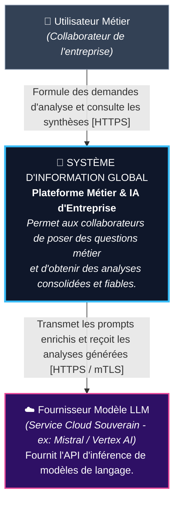
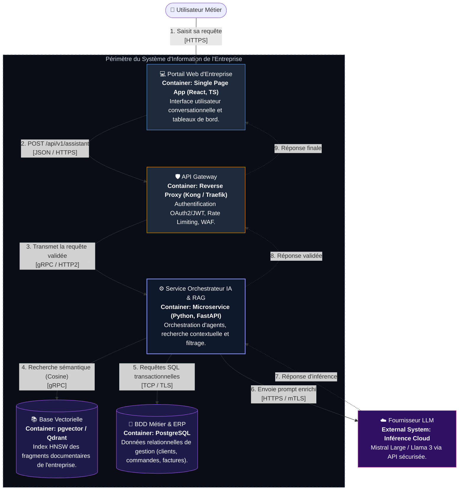
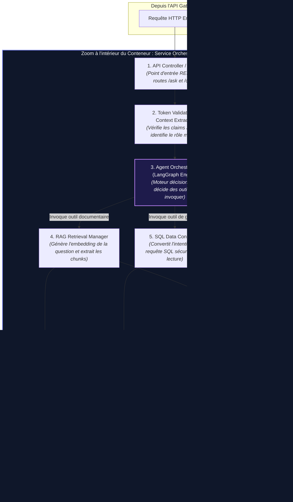
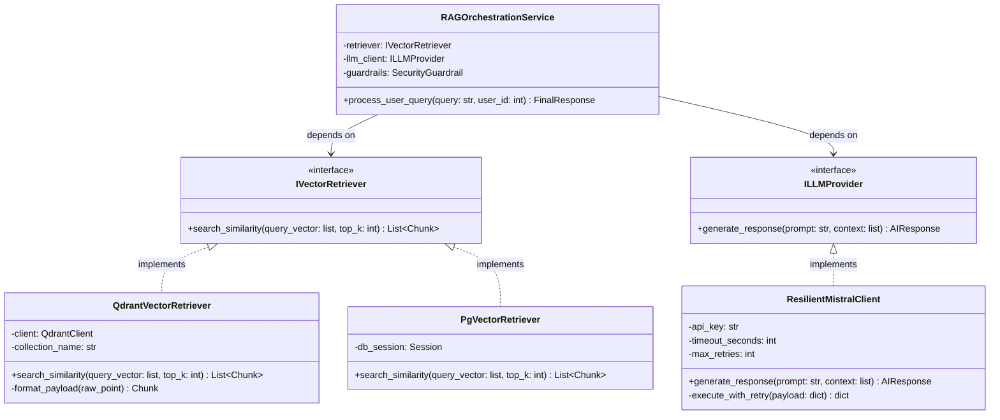

# Modélisation Complète C4 Model (Niveaux 1 à 4)

## Cas Pratique : Connexion d'un Service d'IA (RAG & Agent) au Système d'Information

**Niveau d'étude :** Master 1 Architecture des Systèmes d'Information
**Module :** Connecter l'Intelligence Artificielle aux Systèmes d'Information
**Référentiel méthodologique :** C4 Model (*Simon Brown*)

---

### 📌 Scénario d'Architecture de Référence

> Un **Utilisateur Métier** formule une demande d'analyse ou de synthèse via le **Portail Web d'Entreprise**.
> La requête passe par une **API Gateway** (sécurisation OAuth2/JWT, quotas et rate limiting), puis arrive sur le **Service Orchestrateur IA**.
> Ce dernier interroge la **Base Vectorielle (Qdrant / pgvector)** pour extraire les fragments documentaires pertinents (RAG), et la **Base SQL Métier (ERP / PostgreSQL)** pour récupérer les données transactionnelles à jour.
> L'orchestrateur assemble le prompt enrichi, applique les filtres de sécurité (*Guardrails*), sollicite le **Modèle LLM distant**, puis restitue la réponse validée à l'utilisateur.

---

```
              ┌─────────────────────────────────────────────────────────┐
              │                   VUE SYNTHÉTIQUE C4                     │
              ├─────────────────────────────────────────────────────────┤
              │  [NIVEAU 1]  System Context  (Vision Métier & SI)       │
              │       │                                                 │
              │       ▼                                                 │
              │  [NIVEAU 2]  Container Diagram (Applications & BDD)     │
              │       │                                                 │
              │       ▼                                                 │
              │  [NIVEAU 3]  Component Diagram (Zoom dans l'App IA)     │
              │       │                                                 │
              │       ▼                                                 │
              │  [NIVEAU 4]  Code Diagram (Diagramme de Classes UML)    │
              └─────────────────────────────────────────────────────────┘
```

---

## 📑 Sommaire du Document
- [Scénario d'Architecture de Référence](#-scénario-darchitecture-de-référence)
- [1. Niveau 1 : System Context Diagram (Le Contexte Global)](#1-niveau-1--system-context-diagram-le-contexte)
  - [Objectif & Public](#objectif--public)
  - [Schéma Niveau 1 (Mermaid)](#schéma-niveau-1-mermaid)
  - [Grille de lecture Niveau 1](#grille-de-lecture-niveau-1)
- [2. Niveau 2 : Container Diagram (Les Conteneurs Applicatifs)](#2-niveau-2--container-diagram-les-conteneurs-applicatifs)
  - [Objectif & Public](#objectif--public-1)
  - [Schéma Niveau 2 (Mermaid)](#schéma-niveau-2-mermaid)
  - [Matrice d'Architecture des Conteneurs (Niveau 2)](#matrice-darchitecture-des-conteneurs-niveau-2)
- [3. Niveau 3 : Component Diagram (Les Composants Internes)](#3-niveau-3--component-diagram-les-composants-internes)
  - [Objectif & Public](#objectif--public-2)
  - [Schéma Niveau 3 (Mermaid)](#schéma-niveau-3-mermaid)
  - [Responsabilités des Composants Internes (Niveau 3)](#responsabilités-des-composants-internes-niveau-3)
- [4. Niveau 4 : Code Diagram (L'Implémentation Détaillée)](#4-niveau-4--code-diagram-limplémentation-détaillée)
  - [Objectif & Public](#objectif--public-3)
  - [Schéma Niveau 4 (Mermaid - Diagramme de Classes UML)](#schéma-niveau-4-mermaid---diagramme-de-classes-uml)
  - [Exemple de Code d'Implémentation (Python 3.12 / FastAPI)](#exemple-de-code-dimplémentation-python-312--fastapi)
- [5. Synthèse Récapitulative des 4 Niveaux](#5-synthèse-récapitulative-des-4-niveaux)

---

## 1. Niveau 1 : System Context Diagram (Le Contexte)

### Objectif & Public

* **Pour qui ?** Direction générale, métiers, chefs de projets, auditeurs.
* **Intention :** Montrer le système dans son environnement global sous forme de **boîte noire**. Zéro détail d'implémentation ou de framework.

### Schéma Niveau 1 (Mermaid)



### Grille de lecture Niveau 1

| Élément                         | Type C4             | Description & Responsabilité                                         |
| :-------------------------------- | :------------------ | :-------------------------------------------------------------------- |
| **Utilisateur Métier**     | *Person*          | Collaborateur interne formulant des questions métier complexes.      |
| **Système d'Information**  | *Software System* | Le système global étudié (notre périmètre de responsabilité).   |
| **Fournisseur Modèle LLM** | *External System* | Service externe hébergeant le modèle d'inférence sous contrat SLA. |

---

## 2. Niveau 2 : Container Diagram (Les Conteneurs Applicatifs)

### Objectif & Public

* **Pour qui ?** Architectes d'entreprise, architectes solutions, équipes DevOps, tech leads.
* **Intention :** Ouvrir la boîte noire du SI pour révéler les **unités déployables de manière autonome** (applications, passerelles, services, bases de données), leurs technologies et leurs protocoles.

### Schéma Niveau 2 (Mermaid)



### Matrice d'Architecture des Conteneurs (Niveau 2)

| Conteneur                   | Rôle d'Architecture                     | Technologie retenue             | Protocole d'Échange       |
| :-------------------------- | :--------------------------------------- | :------------------------------ | :------------------------- |
| **Portail Web**       | Interface IHM & Restitution              | React 19, TypeScript, Tailwind  | HTTPS (TLS 1.3)            |
| **API Gateway**       | Point d'entrée unique, DMZ, sécurité  | Kong Gateway Enterprise         | HTTP/2, JWT, OAuth2 / OIDC |
| **Service IA**        | Cœur décisionnel & orchestration RAG   | Python 3.12, FastAPI, LangGraph | gRPC / REST interne        |
| **Base Vectorielle**  | Persistance des embeddings documentaires | Qdrant ou PostgreSQL (pgvector) | gRPC / TCP                 |
| **BDD Métier (ERP)** | Référentiel des opérations de gestion | PostgreSQL (ACID)               | TCP sécurisé (SSL/TLS)   |

---

## 3. Niveau 3 : Component Diagram (Les Composants Internes)

### Objectif & Public

* **Pour qui ?** Tech leads, développeurs backend, ingénieurs IA.
* **Intention :** Zoomer à l'intérieur d'**UN seul conteneur** : ici le **Service Orchestrateur IA (FastAPI)**, pour détailler ses modules logiciels et leurs interactions.

### Schéma Niveau 3 (Mermaid)



### Responsabilités des Composants Internes (Niveau 3)

1. **API Controller :** Reçoit les requêtes, valide les payloads avec Pydantic.
2. **Token Validator :** Contrôle les permissions RBAC pour s'assurer que l'utilisateur a le droit d'accéder aux documents demandés.
3. **Agent Orchestrator :** Boucle de raisonnement (ex: ReAct) qui détermine si la question nécessite des documents (RAG), des données de gestion (SQL), ou les deux.
4. **RAG Retrieval Manager :** Calcul du vecteur par modèle d'embedding et recherche des K plus proches voisins (*Top-K*).
5. **SQL Data Connector :** Génération et exécution de requêtes SQL en lecture seule sur l'ERP.
6. **Prompt & Context Assembler :** Construction du template de prompt avec injection sécurisée des contextes.
7. **Guardrails & DLP :** Détection des fuites de données personnelles (*Personally Identifiable Information*) et blocage des tentatives de contournement (*Jailbreak*).
8. **Resilient LLM Client :** Gestion des connexions, bascule vers un modèle secondaire si le principal est hors service (*Failover*).

---

## 4. Niveau 4 : Code Diagram (L'Implémentation Détaillée)

### Objectif & Public

* **Pour qui ?** Développeurs pour l'écriture du code.
* **Intention :** Présenter les classes, interfaces et contrats d'implémentation du composant critique `RAG Retrieval Manager` et `LLM Client`.

### Schéma Niveau 4 (Mermaid - Diagramme de Classes UML)



### Exemple de Code d'Implémentation (Python 3.12 / FastAPI)

Voici l'extrait de code Python illustrant la structure du diagramme de classe ci-dessus :

```python
from abc import ABC, abstractmethod
from typing import List, Dict
from pydantic import BaseModel

class Chunk(BaseModel):
    id: str
    content: str
    score: float

class IVectorRetriever(ABC):
    @abstractmethod
    def search_similarity(self, query: str, top_k: int = 3) -> List[Chunk]:
        """Recherche les documents les plus proches dans la base vectorielle."""
        pass

class ILLMProvider(ABC):
    @abstractmethod
    def generate_response(self, prompt: str, context: List[Chunk]) -> str:
        """Envoie le prompt enrichi au modèle LLM avec résilience."""
        pass

class RAGOrchestrationService:
    def __init__(self, retriever: IVectorRetriever, llm: ILLMProvider):
        self.retriever = retriever
        self.llm = llm

    def process_query(self, user_question: str) -> Dict[str, str]:
        # 1. Récupération des fragments de contexte
        documents = self.retriever.search_similarity(user_question, top_k=3)
      
        # 2. Construction et appel de l'inférence
        reponse = self.llm.generate_response(prompt=user_question, context=documents)
      
        return {
            "reponse": reponse,
            "sources": [doc.id for doc in documents]
        }
```

---

## 5. Synthèse Récapitulative des 4 Niveaux

|    Niveau    | Nom                 | Périmètre                    | Public Cible        | Décision d'Architecture Clé                                                       |
| :----------: | :------------------ | :----------------------------- | :------------------ | :---------------------------------------------------------------------------------- |
| **C1** | **Context**   | Le SI et le monde extérieur   | Direction, Métier  | Définir les frontières de l'organisation et la conformité externe.               |
| **C2** | **Container** | Applications et BDD du SI      | Architectes, DevOps | Choix des technologies (FastAPI, pgvector), protocoles (gRPC, TLS) et scalabilité. |
| **C3** | **Component** | Sous-modules d'une application | Tech Leads, Devs    | Découpage en responsabilités, séparation RAG / SQL, sécurité des Guardrails.   |
| **C4** | **Code**      | Classes et interfaces          | Développeurs       | Inversion de dépendance (DIP), résilience aux pannes, patterns de conception.     |
