# Compte-Rendu Officiel TP1 — Questions & Réponses
## Étude de cas TECHCORP : API REST, HTTP et premier serveur MCP

**Établissement :** CFA-INSTA — Master 1 Architecte des Systèmes d'Information (4e année)  
**Module :** Connecter l'IA aux Systèmes d'Information (IA, API & MCP)  
**Format :** Question officielle du sujet $\rightarrow$ Réponse technique détaillée en dessous.

---

## 📑 Sommaire Interactif

- [1. Travail Préparatoire (Section 4.1)](#1-travail-préparatoire-section-41)
  - [Question 1 : Réel vs Simulé sur le poste](#question-1--réel-vs-simulé-sur-le-poste)
  - [Question 2 : Analyse statique du jeu de tickets](#question-2--analyse-statique-du-jeu-de-tickets)
  - [Question 3 : Schéma prévisionnel du flux GET /tickets](#question-3--schéma-prévisionnel-du-flux-get-tickets)
- [2. Partie A — Analyse des données et du contrat HTTP (Section 6)](#2-partie-a--analyse-des-données-et-du-contrat-http-section-6)
  - [Tableau des 5 Appels Réalisés (A1 à A5)](#tableau-des-5-appels-réalisés-a1-à-a5)
  - [Question 8 (Logiciel) : Différence fonctionnelle entre GET et POST](#question-8-logiciel--différence-fonctionnelle-entre-get-et-post)
  - [Question 9 (Logiciel) : Champs fournis par le client vs attribués par le serveur](#question-9-logiciel--champs-fournis-par-le-client-vs-attribués-par-le-serveur)
  - [Question 10 (Logiciel) : Code de retour lors de la création et signification](#question-10-logiciel--code-de-retour-lors-de-la-création-et-signification)
  - [Question 11 (Logiciel) : Nombre de tickets retournés dans /status/open](#question-11-logiciel--nombre-de-tickets-retournés-dans-statusopen)
  - [Question 12 (Réseau) : Pourquoi l'adresse 127.0.0.1 est-elle utilisée ?](#question-12-réseau--pourquoi-ladresse-127001-est-elle-utilisée-)
  - [Question 13 (Réseau) : Le client utilise-t-il le port 8000 comme port source ?](#question-13-réseau--le-client-utilise-t-il-le-port-8000-comme-port-source-)
  - [Question 14 (Réseau) : Accès direct d'un autre PC si écoute sur 127.0.0.1](#question-14-réseau--accès-direct-dun-autre-pc-si-écoute-sur-127001)
- [3. Partie B — Analyse croisée du flux avec Wireshark (Section 8)](#3-partie-b--analyse-croisée-du-flux-avec-wireshark-section-8)
  - [Tableau d'Observation Wireshark (Section 7.3)](#tableau-dobservation-wireshark-section-73)
  - [Tableau d'Analyse Croisée Réseau / Logiciel](#tableau-danalyse-croisée-réseau--logiciel)
  - [Question 20 : Pourquoi IP source et destination sont identiques (127.0.0.1) ?](#question-20--pourquoi-ip-source-et-destination-sont-identiques-127001-)
  - [Question 21 : Preuve réelle que l'API a reçu la requête](#question-21--preuve-réelle-que-lapi-a-reçu-la-requête)
  - [Question 22 : La mention « SRV-DNS-01 = DOWN » est-elle une preuve réseau ?](#question-22--la-mention--srv-dns-01--down--est-elle-une-preuve-réseau-)
  - [Question 23 : Impact du chiffrement HTTPS sur la lisibilité Wireshark](#question-23--impact-du-chiffrement-https-sur-la-lisibilité-wireshark)
- [4. Partie C — Comprendre ce que MCP fait réellement (Section 10)](#4-partie-c--comprendre-ce-que-mcp-fait-réellement-section-10)
  - [Tableau des Relevés MCP Inspector (Section 9.3)](#tableau-des-relevés-mcp-inspector-section-93)
  - [Question 29 : Nom du Tool exposé et paramètre attendu](#question-29--nom-du-tool-exposé-et-paramètre-attendu)
  - [Question 30 : Différence fondamentale entre tools/list et tools/call](#question-30--différence-fondamentale-entre-toolslist-et-toolscall)
  - [Question 31 : Le Tool réalise-t-il un vrai ping vers 10.10.20.10 ?](#question-31--le-tool-réalise-t-il-un-vrai-ping-vers-10102010-)
  - [Question 32 : Importance de la distinction « donnée simulée » vs « mesure réelle » pour l'IA](#question-32--importance-de-la-distinction--donnée-simulée--vs--mesure-réelle--pour-lia)
  - [Question 33 : MCP remplace-t-il l'API REST de la Partie A ?](#question-33--mcp-remplace-t-il-lapi-rest-de-la-partie-a-)
  - [Question Extension 10.3 : Tool bonus list_open_servers() et impact réseau](#question-extension-103--tool-bonus-list_open_servers-et-impact-réseau)
- [5. Partie D — Mise en commun et synthèse finale (Section 11)](#5-partie-d--mise-en-commun-et-synthèse-finale-section-11)
  - [Question 34 : Différence architecturale entre API REST et serveur MCP](#question-34--différence-architecturale-entre-api-rest-et-serveur-mcp)
  - [Question 35 : Flux réseau réel observé dans Wireshark lors de GET /status/open](#question-35--flux-réseau-réel-observé-dans-wireshark-lors-de-get-statusopen)
  - [Question 36 : Voit-on le même flux TCP avec MCP sous transport STDIO ? Pourquoi ?](#question-36--voit-on-le-même-flux-tcp-avec-mcp-sous-transport-stdio--pourquoi-)
  - [Question 37 : Pourquoi un futur LLM ne doit-il jamais inventer l'état de SRV-DNS-01 ?](#question-37--pourquoi-un-futur-llm-ne-doit-il-jamais-inventer-létat-de-srv-dns-01-)
  - [Question 38 : Comment transformer get_server_status() en Tool de diagnostic réel ?](#question-38--comment-transformer-get_server_status-en-tool-de-diagnostic-réel-)
  - [Question 39 : Information visible côté dév vs côté réseau](#question-39--information-visible-côté-dév-vs-côté-réseau)
  - [Schéma d'Architecture Final (Chemin REST vs Chemin MCP)](#schéma-darchitecture-final-chemin-rest-vs-chemin-mcp)
- [6. Questions Flash pour l'Oral de 3 Minutes (Annexe C)](#6-questions-flash-pour-loral-de-3-minutes-annexe-c)

---

## 1. Travail Préparatoire (Section 4.1)

### Question 1 : Réel vs Simulé sur le poste
> **Question officielle :** Entourez dans le tableau d’architecture ce qui est réel sur votre poste et ce qui est uniquement simulé.

**Réponse :**
* **Composants Réels sur le poste :**
  1. Le poste physique Windows (`POSTE-ETU`).
  2. L'adresse IP de bouclage `127.0.0.1` (*loopback interface*).
  3. Le processus serveur Web ASGI `uvicorn` écoutant sur le port TCP `8000`.
  4. Le processus Python exécutant le serveur MCP `server.py`.
  5. Les paquets réseau capturés par le pilote `Npcap` dans Wireshark.
* **Composants Uniquement Simulés :**
  1. Les serveurs distants `SRV-DB-01` (`10.10.20.10`), `SRV-WEB-01` (`10.10.20.20`) et `SRV-DNS-01` (`10.10.20.53`).
  2. Les statuts opérationnels (`UP`, `DEGRADED`, `DOWN`).  
  *Justification :* Ces machines n'existent pas physiquement sur le réseau ; ce sont de simples dictionnaires Python stockés en mémoire vive dans la variable globale `SERVERS`.

---

### Question 2 : Analyse statique du jeu de tickets
> **Question officielle :** À partir du jeu de tickets, déterminez sans outil : combien de tickets sont OPEN, combien sont HIGH ou CRITICAL, et quels serveurs sont concernés.

**Réponse :**
* **Nombre de tickets avec le statut `OPEN` :** **4 tickets** (Ticket ID 1, 2, 4 et 5). *Le ticket ID 3 est `CLOSED`.*
* **Nombre de tickets ayant une priorité `HIGH` ou `CRITICAL` :** **3 tickets** :
  * Ticket ID 1 : Priorité `CRITICAL`.
  * Ticket ID 2 : Priorité `HIGH`.
  * Ticket ID 4 : Priorité `HIGH`.
* **Serveurs concernés par ces tickets prioritaires :**
  * `SRV-DNS-01` (concerné par le ticket 1).
  * `SRV-WEB-01` (concerné par les tickets 2 et 4).

---

### Question 3 : Schéma prévisionnel du flux GET /tickets
> **Question officielle :** Sur une feuille, dessinez le flux que vous pensez observer lors de GET /tickets. Ce schéma sera comparé à Wireshark plus tard.

**Réponse :**
Le flux prévisionnel comprend 3 phases séquentielles :
1. **Établissement de la connexion (Handshake TCP 3-Way) :**
   * `Client (Port éphémère)` $\xrightarrow{\text{SYN}}$ `Serveur FastAPI (Port 8000)`
   * `Serveur FastAPI (Port 8000)` $\xrightarrow{\text{SYN, ACK}}$ `Client`
   * `Client` $\xrightarrow{\text{ACK}}$ `Serveur FastAPI`
2. **Échange applicatif HTTP :**
   * `Client` $\xrightarrow{\text{GET /tickets HTTP/1.1}}$ `FastAPI (8000)`
   * `FastAPI (8000)` $\xrightarrow{\text{HTTP/1.1 200 OK + Payload JSON [tickets...]}}$ `Client`
3. **Maintien ou Fermeture :** Connexion conservée active via `keep-alive` ou libérée par `FIN/ACK`.

---

## 2. Partie A — Manipulation de l'API REST & Contrat HTTP (Sections 5 & 6)

### 2.0. Vérifications préalables avant les appels (Section 5.2)

#### 4. Confirmez que Swagger est accessible
* **Statut :** ✔ **Validé**.
* **Observation :** L'interface graphique interactive Swagger UI est parfaitement accessible à l'adresse locale `http://127.0.0.1:8000/docs`. Elle présente la spécification OpenAPI 3.1.0 avec l'intitulé *"TECHCORP Ticketing API - Version 1.0.0"*.

#### 5. Repérez les endpoints disponibles et leur méthode HTTP
* **Inventaire des routes déclarées :**
  * `GET /` : Endpoint racine fournissant un message de bienvenue et l'aiguillage vers la documentation.
  * `GET /tickets` : Récupération de la liste intégrale des tickets d'incident.
  * `GET /status/open` : Filtrage métier renvoyant exclusivement les tickets en statut `OPEN`.
  * `POST /tickets` : Soumission et persistance d'un nouvel incident dans le SI.

#### 6. Identifiez les modèles JSON attendus par l’API
* **Contrat de données Pydantic (`TicketCreate`) :**
  * Pour les requêtes `GET` : Aucun corps (*Request Body*) n'est requis. La réponse applicative est une collection `List[dict]`.
  * Pour la création `POST /tickets` : Un objet JSON obligatoire contenant exactement 3 clés déclaratives :
    ```json
    {
      "title": "string",
      "server": "string",
      "priority": "string"
    }
    ```
  * *Note d'architecture SI :* Les champs techniques `id` (identifiant unique incrémenté) et `status` (défini par défaut à `"OPEN"`) sont calculés et garantis par le serveur. Ils ne doivent pas être transmis par le client.

#### 7. Le profil Réseau note l’IP et le port utilisés par le serveur
* **Coordonnées de socket relevées :**
  * **Adresse IP d'écoute :** `127.0.0.1` (*Interface loopback / localhost - Couche 3 Réseau*).
  * **Port TCP d'écoute :** `8000` (*Port d'écoute statique du serveur FastAPI - Couche 4 Transport*).
  * **Protocole de couche application :** `HTTP/1.1`.
  * **Configuration de capture Wireshark associée :** Filtre `tcp.port == 8000` sur l'adaptateur *Npcap Loopback Adapter*.

---

### Tableau des 5 Appels Réalisés (A1 à A5)

| Test | Méthode | URL / Endpoint | Code HTTP | Type de contenu | Observation technique |
| :---: | :---: | :--- | :---: | :---: | :--- |
| **A1** | `GET` | `/tickets` | **200 OK** | `application/json` | Retourne la liste initiale des 5 tickets au format JSON. |
| **A2** | `GET` | `/status/open` | **200 OK** | `application/json` | Retourne uniquement les 4 tickets filtrés ayant `"status": "OPEN"`. |
| **A3** | `POST` | `/tickets` | **201 Created** | `application/json` | Création du ticket `"Échec de sauvegarde nocturne"`. Le serveur retourne l'objet enrichi avec `"id": 6` et `"status": "OPEN"`. |
| **A4** | `GET` | `/tickets` | **200 OK** | `application/json` | Vérification de la persistance en mémoire : la liste contient désormais 6 tickets. |
| **A5** | `GET` | `/endpoint-inexistant`| **404 Not Found** | `application/json` | FastAPI intercepte l'URL non routée et retourne `{"detail": "Not Found"}`. |

---

### Question 8 (Logiciel) : Différence fonctionnelle entre GET et POST
> **Question officielle :** Dans le scénario TECHCORP, quelle différence fonctionnelle faites-vous entre GET et POST ?

**Réponse :**
* **La méthode `GET`** est une opération de **lecture seule, sûre (*safe*) et idempotente**. Elle interroge l'API pour récupérer l'état courant des tickets sans jamais modifier l'état du système d'information. Répéter l'appel 10 fois produit exactement le même effet.
* **La méthode `POST`** est une opération d'**écriture, non idempotente**. Elle transmet un document JSON dans son corps de requête (*body*) afin de créer une nouvelle ressource dans le système. Chaque appel successif à `POST /tickets` crée un nouveau ticket avec un nouvel identifiant distinct.

---

### Question 9 (Logiciel) : Champs fournis par le client vs attribués par le serveur
> **Question officielle :** Quels champs du ticket sont fournis par le client ? Quels champs pourraient être attribués par le serveur ?

**Réponse :**
* **Champs obligatoirement fournis par le client :**
  * `title` (intitulé de l'incident).
  * `server` (nom d'hôte de la machine impactée, ex: `SRV-DB-01`).
  * `priority` (niveau de criticité déclaré : `LOW`, `MEDIUM`, `HIGH`, `CRITICAL`).
* **Champs attribués et garantis par le serveur :**
  * `id` : Identifiant unique auto-incrémenté généré côté serveur pour éviter les collisions (`id = 6`).
  * `status` : Défini par défaut à `"OPEN"` par la règle métier lors de l'ouverture d'un ticket.
  * *Champs complémentaires possibles en production :* `created_at` (horodatage ISO 8601), `reporter_ip`, `assigned_to`.

---

### Question 10 (Logiciel) : Code de retour lors de la création et signification
> **Question officielle :** Quel code de retour observez-vous lors de la création du ticket ? Que signifie-t-il ?

**Réponse :**
Le code de retour observé est **`201 Created`**.  
Ce code de la norme HTTP/1.1 indique que la requête a été traitée avec succès et qu'elle a abouti à la **création effective d'une nouvelle ressource** sur le serveur. Il se distingue du simple `200 OK` (qui confirme un traitement standard sans création de ressource).

---

### Question 11 (Logiciel) : Nombre de tickets retournés dans /status/open
> **Question officielle :** Dans GET /status/open, combien de tickets sont retournés après votre création ? Expliquez pourquoi ce nombre diffère ou non du jeu initial.

**Réponse :**
Après la création du ticket, l'endpoint `GET /status/open` retourne **5 tickets** (au lieu de 4 initialement).  
*Explication :* Le ticket créé via `POST /tickets` a été automatiquement initialisé avec l'attribut `"status": "OPEN"`. La fonction de filtrage `[t for t in TICKETS if t["status"] == "OPEN"]` l'inclut donc immédiatement dans le jeu de résultats.

---

### Question 12 (Réseau) : Pourquoi l'adresse 127.0.0.1 est-elle utilisée ?
> **Question officielle :** Pourquoi l’adresse 127.0.0.1 est-elle utilisée dans ce TP ?

**Réponse :**
L'adresse `127.0.0.1` correspond à l'interface de **bouclage local (*loopback* ou *localhost*)**.  
Elle est utilisée car le client (le navigateur web / Swagger) et le serveur (l'API FastAPI / Uvicorn) s'exécutent sur la même machine physique. Les communications restent entièrement confinées au sein de la pile réseau interne du système d'exploitation Windows et ne traversent aucune carte réseau physique.

---

### Question 13 (Réseau) : Le client utilise-t-il le port 8000 comme port source ?
> **Question officielle :** Le client utilise-t-il lui aussi le port 8000 comme port source ? Formulez votre hypothèse avant la capture.

**Réponse :**
**NON, le client n'utilise pas le port 8000 comme port source.**  
*Hypothèse et justification technique :* Le port `8000` est le port **destination**, c'est-à-dire le port d'écoute passif réservé par le processus serveur `uvicorn`.  
Le système d'exploitation attribue dynamiquement au client (navigateur / client HTTP) un **port source éphémère** aléatoire choisi dans la plage privée dynamique IANA (généralement entre `49152` et `65535`, par exemple `54210`). Cela permet à l'OS d'identifier de manière unique le socket de communication retour.

---

### Question 14 (Réseau) : Accès direct d'un autre PC si écoute sur 127.0.0.1
> **Question officielle :** Si FastAPI écoutait uniquement sur 127.0.0.1, un autre PC du réseau pourrait-il y accéder directement ? Justifiez.

**Réponse :**
**NON, aucun autre PC du réseau local ne pourrait y accéder.**  
*Justification :* L'adresse `127.0.0.1` lie le socket réseau exclusivement à l'interface loopback interne. La pile IP du noyau rejette tout paquet provenant d'une interface réseau externe destiné à `127.0.0.1`.  
Pour rendre l'API accessible aux autres postes du réseau local, il faudrait lier le serveur à l'adresse wildcard **`0.0.0.0`** (qui écoute sur toutes les interfaces réseau disponibles, y compris l'IP de la carte Ethernet/Wi-Fi) :
```powershell
uvicorn api.app:app --host 0.0.0.0 --port 8000
```

---

## 3. Partie B — Analyse croisée du flux avec Wireshark (Section 8)

### Tableau d'Observation Wireshark (Section 7.3)

| Élément réseau | Valeur observée | Interprétation du groupe |
| :--- | :---: | :--- |
| **IP source** | `127.0.0.1` | Adresse de l'émetteur (boucle locale). |
| **IP destination** | `127.0.0.1` | Adresse du récepteur hébergé sur la même machine. |
| **Port source** | `54210` *(ex.)* | Port éphémère alloué dynamiquement au navigateur web. |
| **Port destination**| `8000` | Port d'écoute du serveur FastAPI (défini au lancement). |
| **Méthode HTTP** | `POST` ou `GET` | Verbe d'action de la couche application HTTP. |
| **Endpoint** | `/tickets` | Ressource ciblée sur le serveur web. |
| **Code HTTP** | `201 Created` / `200 OK` | Statut de réponse généré par l'application Python. |
| **Content-Type** | `application/json` | En-tête indiquant le format de sérialisation des données. |

---

### Tableau d'Analyse Croisée Réseau / Logiciel

| Observation | Question Réseau & Réponse | Question Logiciel & Réponse |
| :--- | :--- | :--- |
| **Port 8000** | **Pourquoi reste-t-il le même côté serveur ?** Car c'est le port d'écoute (*well-known/static binding*) où le service attend en permanence les requêtes. | **Où est-il défini ?** Dans l'argument de la ligne de commande : `--port 8000`. |
| **Port source** | **Pourquoi change-t-il ?** L'OS alloue un nouveau port éphémère pour chaque nouvelle session TCP afin d'isoler les flux. | **Le code le choisit-il ?** Non, FastAPI et le code Python n'ont aucun contrôle sur le port client choisi par l'OS. |
| **GET /status/open** | **À quel moment apparaît la requête ?** Juste après la fin du 3-way handshake TCP (`ACK`). | **Quel endpoint traite la route ?** La fonction `@app.get("/status/open")` dans `api/app.py`. |
| **200 / 201** | **Que prouve la réception du code ?** Que la connexion a réussi et que le serveur applicatif a répondu sans crash. | **Quelle logique le produit ?** Le paramètre `status_code=status.HTTP_201_CREATED` dans le décorateur FastAPI. |
| **JSON** | **Pourquoi est-il lisible ?** Parce que le protocole HTTP standard transmet le payload en texte brut non chiffré. | **Comment est-il utilisé ?** FastAPI le désérialise en objet Pydantic `TicketCreate`. |
| **FIN / ACK** | **Que signifie la fermeture ?** La terminaison propre de la session TCP bilatérale. | **L'appli a-t-elle encore à envoyer ?** Non, la réponse HTTP complète a été transmise au buffer réseau. |

---

### Question 20 : Pourquoi IP source et destination sont identiques (127.0.0.1) ?
> **Question officielle :** Pourquoi l’IP source et l’IP destination sont-elles identiques dans cette capture ?

**Réponse :**
L'IP source et l'IP destination valent toutes les deux `127.0.0.1` car le client HTTP (Swagger / navigateur) et le serveur web (Uvicorn / FastAPI) sont hébergés et exécutés sur la **même station de travail physique**. Le trafic transite exclusivement par le pilote de boucle locale (*Npcap Loopback Adapter*).

---

### Question 21 : Preuve réelle que l'API a reçu la requête
> **Question officielle :** Quelle preuve avez-vous que l’API a réellement reçu votre requête ?

**Réponse :**
La preuve absolue réside dans la présence du **paquet de réponse HTTP émis par le port `8000` vers le port éphémère du client**, contenant :
1. Le code de statut HTTP `200 OK` ou `201 Created`.
2. Le corps JSON généré dynamiquement par l'interpréteur Python (notamment le ticket avec son nouvel `"id": 6` calculé par l'application). Si l'API n'avait pas reçu la requête, le client recevrait un paquet TCP `[RST, ACK]` (connexion refusée) ou un timeout sans aucune réponse applicative.

---

### Question 22 : La mention « SRV-DNS-01 = DOWN » est-elle une preuve réseau ?
> **Question officielle :** Une donnée métier qui dit « SRV-DNS-01 = DOWN » est-elle une preuve réseau ? Expliquez.

**Réponse :**
**NON, absolument pas.**  
La chaîne de caractères `"status": "DOWN"` n'est qu'une donnée textuelle stockée dans une variable en mémoire vive (ou dans une base de données).  
Une véritable preuve réseau nécessiterait l'émission de paquets réels sur le réseau (par exemple une sonde ICMP `ping` restée sans réponse, ou une tentative de poignée de main TCP infructueuse avec drapeau `RST` sur le port DNS 53 vers l'adresse `10.10.20.53`). L'état applicatif ne reflète pas nécessairement l'état instantané du réseau physique.

---

### Question 23 : Impact du chiffrement HTTPS sur la lisibilité Wireshark
> **Question officielle :** Si vous remplaciez HTTP par HTTPS, qu’est-ce qui deviendrait moins lisible dans Wireshark ?

**Réponse :**
Avec HTTPS, l'ensemble de la couche applicative est encapsulé dans une session **TLS (Transport Layer Security)**.  
Deviendraient totalement illisibles pour un observateur Wireshark :
* La méthode HTTP (`GET`, `POST`).
* L'URL et les endpoints précis (`/tickets`, `/status/open`).
* Les en-têtes HTTP (`Content-Type`, cookies, jetons d'autorisation).
* **L'intégralité du corps de la requête et de la réponse JSON**.  
Wireshark ne pourrait voir que la négociation initiale TLS (*Client Hello, Server Hello, Certificats*) puis des blocs de données binaires chiffrées désignés sous le libellé `Application Data`.

---

## 4. Partie C — Comprendre ce que MCP fait réellement (Section 10)

### Tableau des Relevés MCP Inspector (Section 9.3)

| Appel exécuté | Résultat principal | Erreur / Remarque technique |
| :--- | :--- | :--- |
| `get_server_status("SRV-DB-01")` | `{"success": true, "hostname": "SRV-DB-01", "ip": "10.10.20.10", "role": "Database", "status": "UP"}` | Exécution nominale, le serveur est trouvé dans le dictionnaire. |
| `get_server_status("SRV-DNS-01")` | `{"success": true, "hostname": "SRV-DNS-01", "ip": "10.10.20.53", "role": "DNS", "status": "DOWN"}` | Le serveur est trouvé mais renvoie le statut métier `"DOWN"`. |
| `get_server_status("SRV-UNKNOWN-01")` | `{"success": false, "error": "Serveur inconnu"}` | Cas d'erreur géré : levée d'un message explicite pour l'agent IA. |

---

### Question 29 : Nom du Tool exposé et paramètre attendu
> **Question officielle :** Quel est le nom du Tool exposé ? Quel paramètre attend-il ?

**Réponse :**
* **Nom de l'outil (*Tool*) :** `get_server_status`
* **Paramètre attendu :** Un argument nommé `hostname`, de type primitif `string` (chaîne de caractères), représentant le nom d'hôte de la machine (ex: `"SRV-DB-01"`).

---

### Question 30 : Différence fondamentale entre tools/list et tools/call
> **Question officielle :** Quelle différence voyez-vous entre tools/list et tools/call ?

**Réponse :**
* **`tools/list` (Découverte et Introspection) :** Méthode JSON-RPC appelée par le client (l'IA) pour demander au serveur MCP la liste exhaustive des outils disponibles, incluant leur description textuelle et leur schéma de paramètres JSON Schema. C'est le catalogue de compétences.
* **`tools/call` (Exécution) :** Méthode JSON-RPC appelée par le client pour ordonner au serveur MCP d'exécuter une fonction spécifique avec des arguments déterminés, et d'en retourner le résultat structuré.

---

### Question 31 : Le Tool réalise-t-il un vrai ping vers 10.10.20.10 ?
> **Question officielle :** Le Tool réalise-t-il un vrai ping ou une vraie connexion vers 10.10.20.10 ? Comment le savez-vous ?

**Réponse :**
**NON, le Tool ne réalise aucun ping ni aucune connexion réseau vers 10.10.20.10.**  
*Comment nous le savons :*
1. **Preuve logicielle (code source) :** Le code de la fonction `get_server_status()` se contente d'une simple lecture indexée dans la mémoire Python : `SERVERS[hostname]`. Aucun module de socket (`socket`, `requests`, `subprocess.run`) n'est invoqué.
2. **Preuve réseau :** Aucune trame ICMP (Echo Request) ni aucun paquet TCP vers le port 5432 de l'IP 10.10.20.10 n'apparaît dans les interfaces réseau.

---

### Question 32 : Importance de la distinction « donnée simulée » vs « mesure réelle » pour l'IA
> **Question officielle :** Pourquoi cette différence entre « donnée simulée » et « mesure réelle » est-elle importante pour un futur assistant IA ?

**Réponse :**
Cette distinction est capitale pour la **fiabilité opérationnelle et la prévention des hallucinations** de l'IA :
* Si l'assistant IA prend des décisions autonomes (ex: déclencher une procédure d'astreinte ou couper un cluster) en se basant sur une donnée déclarative statique qui est désynchronisée de la réalité terrain, il commettra des erreurs critiques.
* Un architecte de SI doit garantir que les Tools MCP fournis au modèle s'appuient sur des sondes actives fiables (monitoring en temps réel, ping réseau, vérification de port) et non sur de simples données statiques non vérifiées.

---

### Question 33 : MCP remplace-t-il l'API REST de la Partie A ?
> **Question officielle :** MCP remplace-t-il l’API REST de la Partie A ? Justifiez avec l’architecture du TP.

**Réponse :**
**NON, MCP ne remplace pas l'API REST, ils sont parfaitement complémentaires.**  
*Justification architecturale :*
* L'**API REST** expose les ressources métier (les tickets d'incident) pour les applications clientes traditionnelles (interface web, mobile, scripts d'administration) selon les standards du web (HTTP, URL, verbes REST).
* Le **serveur MCP** constitue une couche d'abstraction supérieure spécialement conçue pour les **modèles de langage (LLMs)**. Il traduit les besoins de l'IA sous forme de capacités standardisées (*tools*, *resources*, *prompts*). Dans une architecture d'entreprise, le serveur MCP appelle lui-même souvent l'API REST en arrière-plan pour accomplir ses tâches.

---

### Question Extension 10.3 : Tool bonus list_open_servers() et impact réseau
> **Question officielle :** Ajoutez un Tool list_open_servers() qui retourne uniquement les serveurs dont l’état n’est pas DOWN. Expliquez si cela génère ou non un nouveau flux réseau réel.

**Réponse :**
* **Code Python implémenté :**
```python
@mcp.tool()
def list_open_servers() -> dict:
    """Retourne la liste des serveurs dont l'état opérationnel n'est pas DOWN."""
    operational = {h: d for h, d in SERVERS.items() if d["status"] != "DOWN"}
    return {"success": True, "count": len(operational), "servers": operational}
```
* **Impact réseau :** Cet appel **ne génère aucun flux réseau réel**.  
Comme le serveur MCP communique avec MCP Inspector via les flux standards **STDIO** (processus locaux), l'exécution de la boucle Python se fait intégralement en mémoire vive de la machine hôte. Aucun paquet IP n'est émis.

---

## 5. Partie D — Mise en commun et synthèse finale (Section 11)

### Question 34 : Différence architecturale entre API REST et serveur MCP
> **Question officielle :** Quelle différence faites-vous entre une API REST et un serveur MCP dans ce TP ?

**Réponse :**
* **L'API REST** est un service orienté **Ressources**. Elle expose des URLs fixes manipulées par des verbes HTTP prédéterminés (`GET /tickets`, `POST /tickets`). C'est au développeur humain d'écrire le code pour orchestrer et assembler les appels.
* **Le serveur MCP** est un protocole standardisé orienté **Capacités pour l'IA**. Il s'appuie sur le protocole JSON-RPC pour offrir au LLM un mécanisme d'auto-découverte des fonctions (*tools/list*) et d'exécution dynamique (*tools/call*), permettant à un agent autonome de raisonner et d'agir sans code d'intégration spécifique.

---

### Question 35 : Flux réseau réel observé dans Wireshark lors de GET /status/open
> **Question officielle :** Quand vous appelez GET /status/open, quel flux réel apparaît dans Wireshark ?

**Réponse :**
Dans Wireshark, on observe la séquence exacte suivante :
1. **Poignée de main TCP (3-Way Handshake) :**
   * Paquet `[SYN]` du client (`127.0.0.1:port_éphémère` $\rightarrow$ `127.0.0.1:8000`).
   * Paquet `[SYN, ACK]` du serveur FastAPI (`127.0.0.1:8000` $\rightarrow$ `127.0.0.1:port_éphémère`).
   * Paquet `[ACK]` du client validant la connexion.
2. **Échange de données HTTP :**
   * Paquet `GET /status/open HTTP/1.1` émis par le navigateur.
   * Paquet de confirmation TCP `[ACK]`.
   * Paquet de réponse `HTTP/1.1 200 OK` avec le header `Content-Type: application/json` transportant le tableau des tickets ouverts.
3. Paquet d'acquittement `[ACK]` final du client.

---

### Question 36 : Voit-on le même flux TCP avec MCP sous transport STDIO ? Pourquoi ?
> **Question officielle :** Quand vous exécutez get_server_status() dans MCP Inspector avec STDIO, voyez-vous le même type de flux TCP ? Pourquoi ?

**Réponse :**
**NON, on ne voit aucun flux TCP dans Wireshark avec STDIO.**  
*Pourquoi :* Le mode de transport **STDIO** (*Standard Input / Output*) utilise les canaux d'entrée/sortie standard du système d'exploitation (`stdin` et `stdout`) pour faire communiquer le processus parent (MCP Inspector) et le processus enfant (`python server.py`). L'échange se fait par des tubes (*pipes*) ou buffers en mémoire gérés par le noyau de l'OS. La pile réseau (TCP/IP) n'étant jamais sollicitée, les sondes réseau de Wireshark restent muettes.

---

### Question 37 : Pourquoi un futur LLM ne doit-il jamais inventer l'état de SRV-DNS-01 ?
> **Question officielle :** Pourquoi un futur LLM ne doit-il pas inventer l’état de SRV-DNS-01 ?

**Réponse :**
Un modèle de langage qui invente une information commet une **hallucination**.  
Dans un système d'information de production, si l'IA affirme qu'un serveur critique tel que `SRV-DNS-01` est opérationnel alors qu'il est en panne, les administrateurs ne seront pas alertés, entraînant une interruption prolongée des services de l'entreprise. Inversement, si elle annonce une panne fictive, elle peut déclencher des procédures d'urgence coûteuses et inutiles. L'IA doit toujours fonder ses affirmations sur des faits vérifiés fournis par des Tools fiables.

---

### Question 38 : Comment transformer get_server_status() en Tool de diagnostic réel ?
> **Question officielle :** Comment feriez-vous, lors d’un prochain TP, pour transformer get_server_status() en Tool de diagnostic réel ?

**Réponse :**
Pour en faire un véritable outil de diagnostic actif, il faut remplacer la lecture du dictionnaire statique par une véritable sonde système ou réseau :
1. **Effectuer un test d'écho ICMP (Ping) :**
   ```python
   import subprocess
   res = subprocess.run(["ping", "-n", "1", ip_cible], capture_output=True)
   is_up = (res.returncode == 0)
   ```
2. **Tester l'ouverture réelle du port de service par socket TCP :**
   ```python
   import socket
   sock = socket.socket(socket.AF_INET, socket.SOCK_STREAM)
   sock.settimeout(2.0)
   is_connected = (sock.connect_ex((ip_cible, port_service)) == 0)
   sock.close()
   ```

---

### Question 39 : Information visible côté dév vs côté réseau
> **Question officielle :** Citez une information importante pour le développeur mais difficile à voir dans Wireshark, puis une information importante pour le Réseau mais absente du code métier.

**Réponse :**
* **Information primordiale pour le Développeur (invisible dans Wireshark) :**  
  La trace d'exécution interne du code (*stack trace*), les types et validations des modèles Pydantic, les variables locales en mémoire et les exceptions Python levées avant d'arriver à la couche de sérialisation.
* **Information primordiale pour l'Ingénieur Réseau (absente du code applicatif) :**  
  La santé et la qualité du canal de transport : la taille de la fenêtre de réception TCP (*TCP Window Size*), la latence aller-retour (*RTT - Round Trip Time*), le taux de gigue, les pertes de paquets et les retransmissions réseau (`TCP Retransmission`).

---

### Schéma d'Architecture Final (Chemin REST vs Chemin MCP)

Ce schéma synthétise l'architecture complète du TP1 et distingue le canal réseau du canal applicatif en mémoire :

```mermaid
flowchart TD
    subgraph CheminREST ["1. CHEMIN REST : VISIBLE DANS WIRESHARK (RÉSEAU TCP/IP)"]
        direction LR
        ClientWeb["💻 Client HTTP\n(Swagger / Navigateur)\nIP: 127.0.0.1:Port Éphémère"]
        FastAPI["🛡️ API FastAPI\n(api/app.py)\nIP: 127.0.0.1:8000"]
        
        ClientWeb <==>|"Flux Réseau TCP/IP\n(Visible dans Wireshark - Port 8000)"| FastAPI
    end

    subgraph CheminMCP ["2. CHEMIN MCP : VISIBLE AU NIVEAU APPLICATIF (MÉMOIRE / STDIO)"]
        direction LR
        Inspector["🤖 MCP Inspector\n(Client IA)"]
        MCPServer["⚙️ Serveur MCP\n(server.py / FastMCP)"]
        DataPython[("📦 Mémoire Python\n(Dictionnaire SERVERS)")]

        Inspector <==>|"Transport STDIO\n(Tubes système - Invisible Wireshark)"| MCPServer
        MCPServer <-->|"Appel de fonction Python\nget_server_status()"| DataPython
    end

    classDef rest fill:#1e293b,stroke:#38bdf8,stroke-width:2px,color:#fff;
    classDef mcp fill:#0f172a,stroke:#818cf8,stroke-width:2px,color:#fff;
    classDef data fill:#1e1b4b,stroke:#a855f7,stroke-width:2px,color:#fff;

    class ClientWeb,FastAPI rest;
    class Inspector,MCPServer mcp;
    class DataPython data;
```



---

## 6. Questions Flash pour l'Oral de 3 Minutes (Annexe C)

* **Q-Flash 1 : Pourquoi l’adresse source et l’adresse destination valent-elles toutes les deux 127.0.0.1 dans ce TP ?**  
  *Réponse :* Parce que le client et le serveur sont situés sur la même machine hôte et communiquent par la boucle locale logicielle (*loopback*).
* **Q-Flash 2 : Pourquoi le client n’utilise-t-il pas lui aussi le port 8000 ?**  
  *Réponse :* Le port 8000 est le port d'écoute passif réservé par le serveur. L'OS attribue au client un port source éphémère aléatoire pour acheminer les réponses sans conflit.
* **Q-Flash 3 : À quoi sert JSON dans l’API ?**  
  *Réponse :* À sérialiser des structures de données complexes en texte structuré léger, standardisé et interopérable entre n'importe quel langage et système.
* **Q-Flash 4 : Pourquoi un Tool MCP n’est-il pas automatiquement une API REST ?**  
  *Réponse :* Un Tool MCP est une fonction RPC introspectable par une IA pour agir, tandis qu'une API REST est une architecture orientée ressources basée sur le protocole HTTP.
* **Q-Flash 5 : Quelle différence entre « l’application dit DOWN » et « j’ai prouvé que le service est inaccessible » ?**  
  *Réponse :* « L'application dit DOWN » est une simple métadonnée déclarative stockée. « J'ai prouvé qu'il est inaccessible » découle d'une mesure réseau réelle (échec de ping, port fermé, absence de réponse).
* **Q-Flash 6 : Pourquoi cette distinction est-elle importante avant de brancher un LLM au SI ?**  
  *Réponse :* Pour garantir l'intégrité des décisions prises par l'agent IA, éviter les hallucinations et s'assurer que ses actions reposent sur la réalité opérationnelle de l'infrastructure.
