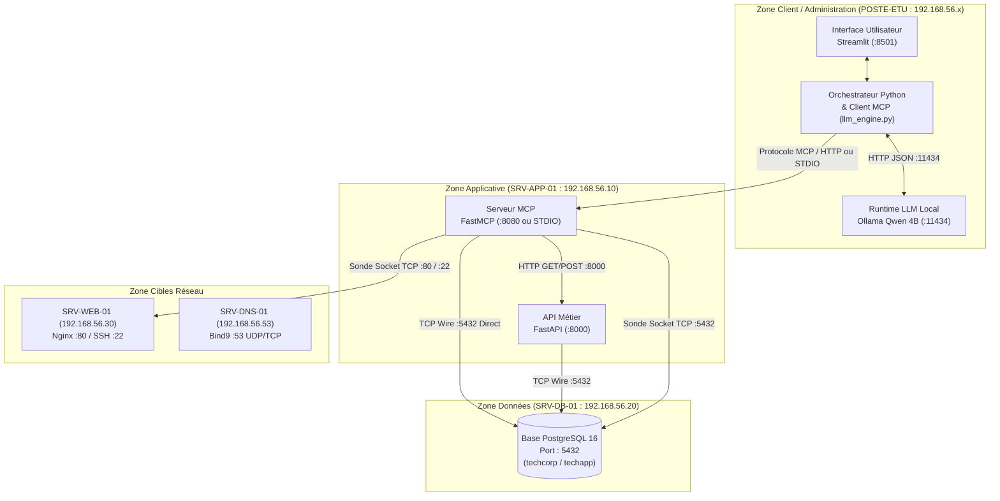

# 📐 DOSSIER D'ARCHITECTURE TECHNIQUE & FLUX RÉSEAU TECHCORP

Ce document technique répond précisément aux 10 questions d'architecture imposées par la section 13.2 du sujet d'examen officiel et détaille la matrice complète des flux, de la sécurité et du contrôle d'accès.

---

## 1. Vue d'Ensemble & Schéma d'Architecture Réseau par Zones

> 📂 **Fichier source Draw.io éditable :** [docs/schema_architecture_reseau.drawio](file:///c:/Users/alves/Desktop/Lyc%C3%A9e,%20bts%20,%20formation,%20master/CFA-insta/Master%201%20SI/TP/TPFINALE/docs/schema_architecture_reseau.drawio) ou dans le classeur global [docs/TECHCORP_TOUS_LES_SCHEMAS.drawio](file:///c:/Users/alves/Desktop/Lyc%C3%A9e,%20bts%20,%20formation,%20master/CFA-insta/Master%201%20SI/TP/TPFINALE/docs/TECHCORP_TOUS_LES_SCHEMAS.drawio).

---

## 2. Réponses aux 10 Questions d'Architecture Obligatoires (Section 13.2)

### Q1. Où tourne le LLM ?

- **Emplacement :** Sur le poste client ou machine locale dédiée (`POSTE-ETU`).
- **Composant :** Runtime **Ollama** exécutant le modèle local **`qwen3:4b`** (ou `qwen:4b`).
- **Port d'écoute :** `11434` (boucle locale `localhost` uniquement).

### Q2. Où tourne l'application IA ?

- **Emplacement :** Sur le poste client ou serveur applicatif (`POSTE-ETU`).
- **Composant :** Application Python `app/main.py` hébergée par le serveur de présentation **Streamlit** (port `8501`).

### Q3. Où se trouve le MCP Client ?

- **Emplacement :** Intégré directement dans la couche d'orchestration de l'application IA (`app/llm_engine.py`).
- **Rôle :** Il intercepte les intentions d'appels d'outils (`tool_call`), communique avec le serveur FastMCP, injecte les résultats factuels dans le prompt système et transmet la synthèse à Streamlit.

### Q4. Où se trouve le MCP Server ?

- **Emplacement :** Déployé sur **SRV-APP-01** (`192.168.56.10`) ou exécuté localement en sous-processus via transport STDIO.
- **Composant :** Développé avec le framework standard **FastMCP** (`mcp_server/server.py`).

### Q5. Qui accède à PostgreSQL ?

Deux composants uniquement ont l'autorisation formelle de se connecter au port `5432` de PostgreSQL :

1. **Le Serveur MCP (`mcp_server/server.py`) :** Pour les Tools de consultation directe `get_server_info(hostname)` et `get_recent_events(hostname)`.
2. **L'API Métier FastAPI (`api/main.py`) :** Pour la persistance et la consultation des tickets d'incidents.

- **Règle de sécurité absolue :** Aucun utilisateur final ni le modèle LLM directement ne dispose de socket ouvert vers PostgreSQL.

### Q6. Qui appelle FastAPI ?

- **Composant appelant :** Exclusivement le **Serveur MCP** via la fonction `list_open_tickets()` et le Tool d'action avancé `create_ticket()`.
- **Protocole :** Requêtes HTTP REST (`GET /tickets/open`, `POST /tickets`) sur le port `8000`.

### Q7. Quels flux traversent réellement le réseau ?

- **Flux Client MCP ➔ Serveur MCP :** Transport HTTP SSE (Server-Sent Events) sur le port `8080` (si distribué).
- **Flux Serveur MCP ➔ FastAPI :** `HTTP/1.1 TCP 8000` (`192.168.56.10:8000`).
- **Flux Serveur MCP / FastAPI ➔ PostgreSQL :** `TCP 5432` vers `192.168.56.20`.
- **Flux Sonde Réseau MCP ➔ Serveurs cibles :** Sondes directes par socket TCP vers `192.168.56.30:80` (Nginx) et `192.168.56.20:5432` (PostgreSQL).

### Q8. Quels flux restent locaux ?

- **Flux Utilisateur ➔ Streamlit UI :** Boucle locale navigateur `localhost:8501`.
- **Flux Orchestrateur Python ➔ Ollama :** Appels HTTP REST sur `127.0.0.1:11434`.
- **Transport MCP en mode STDIO :** Descripteurs standards `stdin`/`stdout` sans socket réseau.

### Q9. Quels ports sont ouverts et pour qui ?

| Hôte / Machine | Port | Protocole | Service | Qui est autorisé à s'y connecter ? |
| :--- | :---: | :---: | :--- | :--- |
| `POSTE-ETU` | `8501` | TCP | Streamlit UI | Navigateur de l'opérateur technique |
| `POSTE-ETU` | `11434` | TCP | Ollama LLM | Orchestrateur Python local uniquement |
| `SRV-APP-01` | `8000` | TCP | FastAPI | Serveur MCP et postes de supervision autorisés |
| `SRV-APP-01` | `8080` | TCP | Serveur MCP (si SSE) | Client MCP autorisé |
| `SRV-DB-01` | `5432` | TCP | PostgreSQL 16 | **Strictement SRV-APP-01** (`192.168.56.10`) et admin |
| `SRV-WEB-01` | `80` | TCP | Nginx Web | Sonde MCP et utilisateurs du réseau |
| `SRV-WEB-01` | `22` | TCP | SSH Admin | Administrateurs réseau (authentification par clé) |
| `SRV-DNS-01` | `53` | UDP/TCP | DNS Named | Tous les serveurs du SI TECHCORP |

### Q10. Où sont stockés les secrets et les logs ?

- **Secrets :**
  - Variables d'environnement isolées dans `.env`, exclu du dépôt Git par `.gitignore`.
  - Mot de passe du compte applicatif `techapp` configuré hors du code source.
  - Aucun mot de passe n'apparaît dans les réponses du LLM ni dans les journaux d'audit.
- **Logs et Traces d'observabilité :**
  - **Traces MCP :** Consignées dans `logs/mcp_audit.jsonl` au format JSON structuré avec UUID et temps d'exécution (`duration_ms`).
  - **Traces d'Audit ETL :** Stockées de manière persistante dans la table `ingestion_audit` de PostgreSQL.
  - **Traces d'API :** Journalisées sur la sortie standard par le middleware FastAPI.

---

## 3. Matrice de Contrôle d'Accès par Rôles (RBAC)

La sécurité d'exploitation s'appuie sur la table `roles` alimentée depuis `etl/data_raw/roles_raw.csv` :

| Rôle | Tools MCP Autorisés | Validation Action Sensible (`can_confirm_action`) |
| :--- | :--- | :---: |
| `support_n1` | `get_server_info`, `list_open_tickets`, `get_recent_events` | ❌ Non |
| `ops_system` | `get_server_info`, `list_open_tickets`, `get_recent_events`, `check_server_availability`, `get_last_service_check` | ❌ Non |
| `lead_ops` | `get_server_info`, `list_open_tickets`, `get_recent_events`, `check_server_availability`, `get_last_service_check`, `create_ticket` | ✅ Oui |
| `admin_si` | `*` (Ensemble des outils du serveur MCP) | ✅ Oui |
